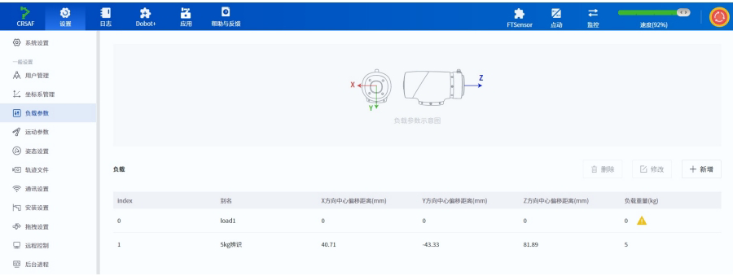

# Arm Secondary Development Documentation - Section 2

## 2.1 Control-Related Commands

# Command List

| **Command**       | **Function**                                    | **Command Type** |
| ----------------- | ----------------------------------------------- | ---------------- |
| RequestControl    | Request to switch device control mode to TCP mode | Immediate        |
| PowerOn           | Robot power on                                  | Immediate        |
| EnableRobot       | Enable robot                                    | Immediate        |
| DisableRobot      | Disable robot                                   | Immediate        |
| ClearError        | Clear robot alarm                               | Immediate        |
| RunScript         | Run specified project                           | Immediate        |
| Stop              | Stop motion (or running project)                | Immediate        |
| Pause             | Pause motion (or running project)               | Immediate        |
| Continue          | Continue motion (or paused project)             | Immediate        |
| EmergencyStop     | Emergency stop robot                            | Immediate        |
| BrakeControl      | Control brake of specified joint                | Immediate        |
| StartDrag         | Robot enters joint drag mode                    | Immediate        |
| StopDrag          | Robot exits drag mode                           | Immediate        |

# RequestControl

**Prototype**

RequestControl()

# Description

Request to switch device control mode to TCP mode. Other TCP commands can only be executed in TCP mode.

TCP mode can only be switched when the robot is powered off or disabled (and not in paused or brake-released state).

# Return

```
ErrorID, {},RequestControl();
```

# Example

RequestControl()

Request to switch to TCP mode.

# Scenarios Where TCP Mode Switching Is Allowed

| **Controller State**                         | **TCP Mode Switching Allowed** |
| -------------------------------------------- | ------------------------------ |
| Powered off                                  | Allowed                        |
| Disabled (not paused, brake not released)    | Allowed                        |
| Enabled and idle                             | Not allowed                    |
| Drag mode                                    | Not allowed                    |
| Single motion in progress                    | Not allowed                    |
| Running                                      | Not allowed                    |
| Paused                                       | Not allowed                    |
| Error (while enabled)                        | Not allowed                    |
| Brake released                               | Not allowed                    |
| Manual/automatic mode enabled                | Not allowed                    |

# PowerOn

# Prototype

PowerOn()

# Description

Robot power on. It takes approximately 10 seconds for the robot to complete power-on, after which the enable operation can be performed. Do not send control signals before the robot's initialization is complete, otherwise it may cause abnormal robot behavior.

# Return

```
ErrorID, {},PowerOn();
```

# Example

```
PowerOn()
```

Power on the robot.

# EnableRobot

# Prototype

```
EnableRobot(load,centerX,centerY,centerZ,isCheck)
```

# Description

Enable the robot.

# Optional Parameters

| **Parameter** | **Type** | **Description**                                                                                                                                                                  |
| ------------- | -------- | -------------------------------------------------------------------------------------------------------------------------------------------------------------------------------- |
| load          | double   | Load weight setting. The value must not exceed the load range of the corresponding robot model. Unit: kg.                                                                        |
| centerX       | double   | Eccentricity distance in X direction. Unit: mm.                                                                                                                                  |
| centerY       | double   | Eccentricity distance in Y direction. Unit: mm.                                                                                                                                  |
| centerZ       | double   | Eccentricity distance in Z direction. Unit: mm.                                                                                                                                  |
| isCheck       | int      | Whether to check the load. 1 = check, 0 = do not check. Default is 0. If set to 1, the robot will check if the actual load matches the set load after enabling, and will automatically disable if they do not match. |

The number of parameters that can be carried:

· 0: No parameters, indicating no load weight and eccentricity parameters are set when enabling.

· 1: One parameter, representing load weight.

· 4: Four parameters, representing load weight and eccentricity parameters.

· 5: Five parameters, representing load weight, eccentricity parameters, and whether to check the load.

# Return

```
ErrorID, {}, EnableRobot(load, centerX, centerY, centerZ, isCheck);
```

# Example 1

```
EnableRobot()
```

Enable the robot without setting load weight and eccentricity parameters.

# Example 2

```
EnableRobot(1.5)
```

Enable the robot with a load weight of 1.5kg.

# Example 3

```
EnableRobot(1.5,0,0,30.5)
```

Enable the robot with a load weight of 1.5kg, Z-axis eccentricity of 30.5mm, without load checking.

# Example 4

```
EnableRobot(1.5,0,0,30.5,1)
```

Enable the robot with a load weight of 1.5kg, Z-axis eccentricity of 30.5mm, with load checking.

# DisableRobot

# Prototype

```
DisableRobot()
```

# Description

Disable the robot.

# Return

```
ErrorID, {}, DisableRobot();
```

# Example

```
DisableRobot()
```

Disable the robot.

# ClearError

# Prototype

```
ClearError()
```

# Description

Clear robot alarm. After clearing the alarm, the user can check whether the robot is still in an alarm state using RobotMode. Some alarms require resolving the alarm cause or restarting the control cabinet before they can be cleared.

# Return

```
ErrorID, {},ClearError();
```

# Example

```
uint64_t robotMode = parseRobotMode(RobotMode()); // parseRobotMode is used to get the return value of RobotMode command, implement it yourself
if(robotMode=9){
    ClearError()
}
```

Clear robot alarm.

# RunScript

# Prototype

```
RunScript(projectName)
```

# Description

Run specified project. If you need to pause immediately after running the project, you must send the Pause command at least 1 second after sending the RunScript command.

# Required Parameters

| **Parameter** | **Type** | **Description**                                                                                                                                    |
| ------------- | -------- | -------------------------------------------------------------------------------------------------------------------------------------------------- |
| projectName   | string   | Project file name. If the name contains Chinese characters, the sender's encoding must be set to UTF-8, otherwise Chinese characters will be received incorrectly. If the name is purely numeric, double quotes must be added. |

# Return

```
ErrorID, {}, RunScript(projectName);
```

# Example 1

```
RunScript(demo)
```

Run the script project named "demo".

# Example 2

RunScript("123")

Run the script project named "123".

# Example 3

RunScript("blockly\_test")

DobotStudio Pro automatically adds the "blockly\_" prefix when saving block programming projects. For example, if you save a block programming project named "test" in DobotStudio Pro, you need to specify the project name as "blockly\_test" when executing this command.

# Stop

**Prototype**

Stop()

# Description

Stop the motion command queue or the project running via RunScript.

# Return

ErrorID,\{},Stop();

# Example

Stop()

Stop jogging, script running, joint motion, and other motions.

# Pause

# Prototype

Pause()

# Description

Pause the motion command queue or the project running via RunScript.

# Return

```
ErrorID, {},Pause();
```

# Example

```
Pause()
```

Pause motions such as movj(), putting the robot in a paused state. Jogging cannot be paused.

# Continue

# Prototype

```
Continue()
```

# Description

Continue the paused motion command queue or the project running via RunScript.

# Return

```
ErrorID, {}, Continue();
```

# Example

```
Continue()
```

Continue motion. Algorithm queue commands in paused state can continue moving, and the robot enters running state.

# EmergencyStop

# Prototype

```
EmergencyStop(mode)
```

# Description

Emergency stop the robot. After emergency stop, the robot will be disabled and an alarm will be triggered. You need to release the emergency stop and clear the alarm before re-enabling.

# Required Parameters

| **Parameter** | **Type** | **Description**                                   |
| ------------- | -------- | ------------------------------------------------- |
| mode          | int      | Emergency stop operation mode. 1 = press emergency stop, 0 = release emergency stop. |

# Return

ErrorID,\{},EmergencyStop(mode);

# Example

EmergencyStop(1)

Emergency stop the robot.

# BrakeControl

# Prototype

BrakeControl(axisID,value)

# Description

Control the brake of a specified joint. When the robot is stationary, the joint will automatically brake. If the user needs to perform joint drag operations, the brake can be released when the robot is in disabled state by manually supporting the joint and then sending the brake release command.

Joint brake can only be controlled when the robot is disabled, otherwise ErrorID will return -1.

# Required Parameters

| **Parameter** | **Type** | **Description**                                                                                     |
| ------------- | -------- | --------------------------------------------------------------------------------------------------- |
| axisID        | int      | Joint axis number. Range: [1,6]. 1 represents J1 axis, 2 represents J2 axis, and so on.            |
| value         | int      | Brake status setting. 0 = brake locked (joint cannot move). 1 = brake released (joint can move). |

# Return

ErrorID,\{},BrakeControl(axisID,value);

# Example

# BrakeControl(1,1)

Release the brake of joint 1.

# StartDrag

# Prototype

StartDrag()

# Description

Robot enters joint drag mode. When the robot is in an alarm state, it cannot enter joint drag mode through this command.

# Return

```
ErrorID, {},StartDrag();
```

# Example

```
StartDrag()
```

Robot enters joint drag mode.

# StopDrag

# Prototype

```
StopDrag()
```

# Description

Robot exits drag mode. Both joint drag and force control drag use this command to exit.

# Return

```
ErrorID, {}, StopDrag();
```

# Example

```
StopDrag()
```

Robot exits drag mode.

## 2.2 Settings-Related Commands

# Command List

| **Command**            | **Function**                            | **Command Type** |
| ---------------------- | --------------------------------------- | ---------------- |
| SpeedFactor            | Set global speed ratio                  | Immediate        |
| User                   | Set global user coordinate system       | Queued           |
| SetUser                | Modify specified user coordinate system | Immediate        |
| CalcUser               | Calculate user coordinate system        | Immediate        |
| Tool                   | Set global tool coordinate system       | Queued           |
| SetTool                | Modify specified tool coordinate system | Immediate        |
| CalcTool               | Calculate tool coordinate system        | Immediate        |
| SetPayload             | Set robot end-effector load             | Queued           |
| AccJ                   | Set joint motion acceleration ratio     | Immediate        |
| AccL                   | Set linear/arc motion acceleration ratio| Immediate        |
| VelJ                   | Set joint motion speed ratio            | Immediate        |
| VelL                   | Set linear/arc motion speed ratio       | Immediate        |
| CP                     | Set smooth transition ratio             | Immediate        |
| SetCollisionLevel      | Set collision detection level           | Queued           |
| SetBackDistance         | Set collision back-off distance         | Queued           |
| SetPostCollisionMode   | Set post-collision handling mode        | Queued           |
| DragSensitivity        | Set drag sensitivity                    | Immediate        |
| EnableSafeSkin         | Enable/disable safe skin function       | Queued           |
| SetSafeSkin            | Set sensitivity for safe skin parts     | Queued           |
| SetSafeWallEnable      | Enable/disable specified safe wall      | Queued           |
| SetWorkZoneEnable      | Enable/disable specified work zone      | Queued           |

# Note:

Unless otherwise specified, parameters set by TCP commands only take effect during the current TCP/IP control mode.

# SpeedFactor

# Prototype

SpeedFactor(ratio)

# Description

Set global speed ratio.

● Actual motion acceleration/speed ratio during robot jogging = value set in control software jogging settings × global speed ratio.

Example: If the joint speed set in the control software is 12°/s and the global rate is 50%, then the actual jogging speed is 12°/s × 50% = 6°/s

● Actual motion acceleration/speed ratio during robot playback = ratio set in motion command optional parameters × value set in control software playback settings × global speed ratio.

Example: If the coordinate speed set in the control software is 2000mm/s, the global rate is 50%, and the motion command rate is 80%, then the actual motion speed is 2000mm/s × 50% × 80% = 800mm/s

If not set, the value from before entering TCP/IP control mode is used.

# Required Parameters

| **Parameter** | **Type** | **Description**                          |
| ------------- | -------- | ---------------------------------------- |
| ratio         | int      | Global motion speed ratio. Range: [1, 100]. |

# Return

ErrorID,\{},SpeedFactor(ratio);

# Example

SpeedFactor(80)

Set global motion speed ratio to 80%.

# User

# Prototype

User(index)

# Description

Set global user coordinate system. Users can select a user coordinate system when sending motion commands. If not specified, the global user coordinate system is used.

If not set, the default global user coordinate system is user coordinate system 0.

# Required Parameters

| **Parameter** | **Type** | **Description**                                                                                      |
| ------------- | -------- | ---------------------------------------------------------------------------------------------------- |
| index         | int      | Index of the calibrated user coordinate system. Must be calibrated through control software before selection here. Range: [0,50]. |

# Return

```
ErrorID, {ResultID}, User(index);
```

If ErrorID returns -1, the setting failed. ResultID is the algorithm queue ID, which can be used to determine command execution order.

# Example

```
User(1)
```

Set user coordinate system 1 as the global user coordinate system.

# SetUser

# Prototype:

```
SetUser(index, value, type)
```

# Description:

Modify a specified user coordinate system.

# Required Parameters:

| **Parameter** | **Type** | **Description**                                                                                      |
| ------------- | -------- | ---------------------------------------------------------------------------------------------------- |
| index         | int      | Index of the calibrated user coordinate system. Must be calibrated through control software before selection here. Range: [1,50]. |
| value         | string   | Modified user coordinate system, format: {x, y, z, rx, ry, rz}. It is recommended to use the CalcUser command to obtain this. |

# Optional Parameters:

| **Parameter** | **Type** | **Description**                                                                                                                      |
| ------------- | -------- | ------------------------------------------------------------------------------------------------------------------------------------ |
| type          | int      | Whether the coordinate system change takes effect globally. 0: The coordinate system modified by this command only takes effect during the current project run and reverts to the original value after exiting TCP mode. 1: The coordinate system modified by this command will be saved by the controller and remains modified after exiting TCP mode. |

# Return:

```
ErrorID, {}, SetUser(index, table, type);
```

# Example:

```
SetUser(1,{10,10,10,0,0,0})
```

Modify user coordinate system 1 to $x=10, y=10, z=10, rx=0, ry=0, rz=0$.

# CalcUser

# Prototype:

```
CalcUser(index,matrix,offset)
```

# Description:

Calculate user coordinate system.

# Required Parameters:

| **Parameter** | **Type** | **Description**                                                                                                                                                           |
| ------------- | -------- | ------------------------------------------------------------------------------------------------------------------------------------------------------------------------- |
| index         | int      | Index of the calibrated user coordinate system. Must be calibrated through control software before selection here. Range: [0,50].                                        |
| matrix        | int      | Calculation direction. 1 = left multiply, meaning the coordinate system specified by index rotates by the offset relative to the base coordinate system. 0 = right multiply, meaning the coordinate system specified by index rotates by the offset relative to itself. |
| offset        | string   | Format: {x, y, z, rx, ry, rz}, representing the offset value of the user coordinate system.                                                                              |

# Return:

```
ErrorID, {x,y,z,rx,ry,rz},CalcUser(index,matrix,offset);
```

{x, y, z, rx, ry, rz} is the calculated user coordinate system.

Example 1:

```
newUser = CalcUser(1,1,{10,10,10,10,10,10})
```

Calculate the value after left-multiplying user coordinate system 1 by {10,10,10,0,0,0}. The calculation process is equivalent to: a coordinate system with the same initial pose as user coordinate system 1, translated by {x=10, y=10, z=10} and rotated by {rx=10, ry=10, rz=10} relative to the base coordinate system, resulting in a new coordinate system newUser.

# Example 2:

```
newUser = CalcUser(1,0,{10,10,10,10,10,10})
```

Calculate the value after right-multiplying user coordinate system 1 by {10,10,10,0,0,0}. The calculation process is equivalent to: a coordinate system with the same initial pose as user coordinate system 1, translated by {x=10, y=10, z=10} and rotated by {rx=10, ry=10, rz=10} relative to user coordinate system 1, resulting in a new coordinate system newUser.

# Tool

# Prototype

```
Tool(index)
```

# Description

Set global tool coordinate system. Users can select a tool coordinate system when sending motion commands. If not specified, the global tool coordinate system is used.

If not set, the default global tool coordinate system is tool coordinate system 0.

# Required Parameters

| **Parameter** | **Type** | **Description**                                                                                      |
| ------------- | -------- | ---------------------------------------------------------------------------------------------------- |
| index         | int      | Index of the calibrated tool coordinate system. Must be calibrated through control software before selection here. Range: [0,50]. |

# Return

```
ErrorID,{ResultID},Tool(index);
```

If ErrorID returns -1, the specified tool coordinate index does not exist; ResultID is the algorithm queue ID, which can be used to determine command execution order.

# Example

Tool(1)

Set tool coordinate system 1 as the global tool coordinate system.

# SetTool

# Prototype:

SetTool(index,value,type)

# Description:

Modify a specified tool coordinate system.

# Required Parameters:

| **Parameter** | **Type** | **Description**                                                                                          |
| ------------- | -------- | -------------------------------------------------------------------------------------------------------- |
| index         | int      | Index of the calibrated tool coordinate system. Must be calibrated through control software before selection here. Range: [1,50]. |
| value         | string   | Modified tool coordinate system, format: {x, y, z, rx, ry, rz}. Represents the offset of this coordinate system relative to the default tool coordinate system. |

# Optional Parameters:

| **Parameter** | **Type** | **Description**                                                                                                                      |
| ------------- | -------- | ------------------------------------------------------------------------------------------------------------------------------------ |
| type          | int      | Whether the coordinate system change takes effect globally. 0: The coordinate system modified by this command only takes effect during the current project run and reverts to the original value after exiting TCP mode. 1: The coordinate system modified by this command will be saved by the controller and remains modified after exiting TCP mode. |

# Return:

ErrorID,\{},SetTool(index,table,type);

# Example:

SetTool(1,\{10,10,10,0,0,0})

Modify tool coordinate system 1 to $x=10, y=10, z=10, rx=0, ry=0, rz=0$.

# CalcTool

Prototype:

CalcTool(index,matrix,offset)

# Description:

Calculate tool coordinate system.

# Required Parameters:

| **Parameter** | **Type** | **Description**                                                                                                                                                           |
| ------------- | -------- | ------------------------------------------------------------------------------------------------------------------------------------------------------------------------- |
| index         | int      | Index of the calibrated tool coordinate system. Must be calibrated through control software before selection here. Range: [0,50].                                        |
| matrix        | int      | Calculation direction. 1 = left multiply, meaning the tool coordinate system specified by index rotates by the offset relative to the flange coordinate system. 0 = right multiply, meaning the tool coordinate system specified by index rotates by the offset relative to itself. |
| offset        | string   | Format: {x, y, z, rx, ry, rz}, representing the offset value of the tool coordinate system.                                                                              |

Return:

ErrorID,\{x,y,z,rx,ry,rz},CalcTool(index,matrix,offset);

{x, y, z, rx, ry, rz} is the calculated tool coordinate system.

# Example 1:

​$\text{CalcTool}(1,1,\{ 10,10,10,0,0,0\})$​

Calculate the value after left-multiplying tool coordinate system 1 by {10,10,10,0,0,0}. The calculation process is equivalent to: a coordinate system with the same initial pose as tool coordinate system 1, translated by {x=10, y=10, z=10} and rotated by {rx=10, ry=10, rz=10} relative to the flange coordinate system, resulting in a new coordinate system newTool.

# Example 2:

​$\text{CalcTool}(1,0,\{ 10,10,10,0,0,0\})$​

Calculate the value after right-multiplying tool coordinate system 1 by {10,10,10,0,0}. The calculation process is equivalent to: a coordinate system with the same initial pose as tool coordinate system 1, translated by {x=10, y=10, z=10} and rotated by {rx=10, ry=10, rz=10} relative to tool coordinate system 1, resulting in a new coordinate system newTool.

# SetPayload

# Prototype

SetPayload(load,x,y,z)

SetPayload(name)

# Description

Set robot end-effector load, supporting two configuration methods.

# Method 1: Direct load parameter setting

# Required Parameter 1

| **Parameter** | **Type** | **Description**                                                       |
| ------------- | -------- | --------------------------------------------------------------------- |
| load          | double   | Load weight setting. Unit: kg. The value must not exceed the load range of the corresponding robot model. |

# Optional Parameter 1

| **Parameter** | **Type** | **Description**                |
| ------------- | -------- | ------------------------------ |
| x             | double   | End-effector load X-axis eccentric coordinate. Unit: mm. |
| y             | double   | End-effector load Y-axis eccentric coordinate. Unit: mm. |
| z             | double   | End-effector load Z-axis eccentric coordinate. Unit: mm. |

These three parameters must be set simultaneously or not at all. The eccentric coordinates are the center of mass coordinates of the load (including fixture) in the default tool coordinate system, as shown in the figure below.

# Method 2: Load by preset load parameter group from control software

# Required Parameter 2

| **Parameter** | **Type** | **Description**                           |
| ------------- | -------- | ----------------------------------------- |
| name          | string   | Name of the preset load parameter group saved in the control software. |



# Return

ErrorID,\{\ResultID},SetPayload(load,x,y,z);

ErrorID,\{\ResultID},SetPayload(name);

ResultID is the algorithm queue ID, which can be used to determine command execution order.

# Example 1

SetPayload(3,10,10,10)

Set end-effector load weight to 3kg, eccentric coordinates {10,10,10}.

# Example 2

SetPayload("Load1")

Load the preset load parameter group named "Load1".

# AccJ

# Prototype

AccJ(R)

# Description

Set joint motion acceleration ratio.

Default value if not set is 100.

# Required Parameters

| **Parameter** | **Type** | **Description**                  |
| ------------- | -------- | -------------------------------- |
| R             | int      | Joint acceleration ratio. Range: [1,100] |

# Return

```
ErrorID, {},AccJ(R);
```

# Example

```
AccJ(50)
```

Set joint motion acceleration ratio to 50%.

# AccL

# Prototype

AccL(R)

# Description

Set linear and arc motion acceleration ratio.

Default value if not set is 100.

# Required Parameters

| **Parameter** | **Type** | **Description**                |
| ------------- | -------- | ------------------------------ |
| R             | int      | Acceleration ratio. Range: [1,100] |

# Return

```
ErrorID, {},AccL(R);
```

# Example

AccL (50)

Set linear and arc motion acceleration ratio to 50%.

# VelJ

# Prototype

VelJ(R)

# Description

Set joint motion speed ratio.

Default value if not set is 100.

# Required Parameters

| **Parameter** | **Type** | **Description**               |
| ------------- | -------- | ----------------------------- |
| R             | int      | Speed ratio. Range: [1,100] |

# Return

```
ErrorID, {},VelJ(R);
```

# Example

```
VelJ(50)
```

Set joint motion speed ratio to 50%.

# VelL

# Prototype

VelL(R)

# Description

Set linear and arc motion speed ratio.

Default value if not set is 100.

# Required Parameters

| **Parameter** | **Type** | **Description**               |
| ------------- | -------- | ----------------------------- |
| R             | int      | Speed ratio. Range: [1,100] |

# Return

ErrorID,\{},VelL(R);

# Example

VelL(50)

Set linear and arc motion speed ratio to 50%.

# CP

# Prototype

CP(R)

# Description

Set smooth transition ratio, which determines whether the robot passes through intermediate points at right angles or in curves when continuously moving through multiple points.

Default value if not set is 0.

# Required Parameters

| **Parameter** | **Type** | **Description**                  |
| ------------- | -------- | -------------------------------- |
| R             | int      | Smooth transition ratio. Range: [0, 100] |

# Return

ErrorID, \{},CP(R);

# Example

CP(50)

Set smooth transition ratio to 50%.

# SetCollisionLevel

# Prototype

SetCollisionLevel(level)

# Description

Set collision detection level.

If not set, the value from before entering TCP/IP control mode is used.

# Required Parameters

| **Parameter** | **Type** | **Description**                                                                                                          |
| ------------- | -------- | ------------------------------------------------------------------------------------------------------------------------ |
| level         | int      | Collision detection level. Range: $[0,5]$. 0 = collision detection off, $1\sim5$ higher numbers = higher sensitivity. |

# Return

```
ErrorID,{ResultID},SetCollisionLevel(level);
```

ResultID is the algorithm queue ID, which can be used to determine command execution order.

# Example

```
SetCollisionLevel(1)
```

Set collision detection level to 1.

# SetBackDistance

# Prototype:

```
SetBackDistance(distance)
```

# Description:

Set the distance the robot backs off after detecting a collision.

If not set, the value from before entering TCP/IP control mode is used.

# Required Parameters:

| **Parameter** | **Type** | **Description**                           |
| ------------- | -------- | ----------------------------------------- |
| distance      | double   | Collision back-off distance. Range: [0,50], Unit: mm. |

# Return

```
ErrorID, {ResultID}, SetBackDistance(distance)
```

ResultID is the algorithm queue ID, which can be used to determine command execution order.

# Example:

```
SetBackDistance(20)
```

Set collision back-off distance to 20mm.

# SetPostCollisionMode

# Prototype:

```
SetPostCollisionMode(mode)
```

# Description:

Set the state the robot enters after detecting a collision.

If not set, the value from before entering TCP/IP control mode is used.

# Required Parameters:

| **Parameter** | **Type** | **Description**                                                                 |
| ------------- | -------- | ------------------------------------------------------------------------------- |
| mode          | int      | Post-collision handling mode. 0 = enter stopped state after collision, 1 = enter paused state after collision. |

# Return

```
ErrorID,{ResultID},SetPostCollisionMode(mode)
```

ResultID is the algorithm queue ID, which can be used to determine command execution order.

# Example:

```
SetPostCollisionMode(0)
```

Set robot to enter stopped state after collision detection.

# DragSensitivity

# Prototype

DragSensitivity(index,value)

# Description

Set drag sensitivity.

If not set, the value from before entering TCP/IP control mode is used.

# Required Parameters

| **Parameter** | **Type** | **Description**                                                                                                                        |
| ------------- | -------- | -------------------------------------------------------------------------------------------------------------------------------------- |
| index         | int      | Axis number. Range: [0,6]. 0 = set all axes to the same sensitivity. 1~6 set the sensitivity for J1~J6 axes respectively.             |
| value         | int      | Drag sensitivity. Lower values = greater resistance when dragging. Range: [1, 90].                                                     |

# Return

ErrorID, \{},DragSensitivity(index,value);

# Example

DragSensitivity(0,50)

Set drag sensitivity for all axes to 50.

# EnableSafeSkin

# Prototype

EnableSafeSkin(status)

# Description

Enable or disable the safe skin function. Only effective for robots equipped with safe skin.

# Required Parameters

| **Parameter** | **Type** | **Description**                                    |
| ------------- | -------- | -------------------------------------------------- |
| status        | int      | Electronic skin function switch. 0 = disable, 1 = enable. |

# Return

```
ErrorID, {ResultID}, EnableSafeSkin(status);
```

ResultID is the algorithm queue ID, which can be used to determine command execution order. If ErrorID returns -1, it may be that no electronic skin is currently installed.

# Example

```
EnableSafeSkin(1)
```

Enable electronic skin function.

# SetSafeSkin

# Prototype

```
SetSafeSkin(part,status)
```

# Description

Set sensitivity for different parts of the safe skin. Only effective for robots equipped with safe skin.

If not set, the value from before entering TCP/IP control mode is used.

# Required Parameters

| **Parameter** | **Type** | **Description**                                                                                          |
| ------------- | -------- | -------------------------------------------------------------------------------------------------------- |
| part          | int      | Part to set. 3 = arm (forearm safe skin), 4~6 represent J4~J6 joints respectively.                       |
| status        | int      | Sensitivity. 0 = off, 1 = low, 2 = middle, 3 = high.                                                     |

# Return

```
ErrorID,{ResultID},SetSafeSkin(part,status);
```

ResultID is the algorithm queue ID, which can be used to determine command execution order.

# Example

SetSafeSkin(3,1)

Set forearm electronic skin to low sensitivity.

# SetSafeWallEnable

# Prototype:

```
SetSafeWallEnable(index, value)
```

# Description:

Enable or disable a specified safe wall.

# Required Parameters:

| **Parameter** | **Type** | **Description**                                                                                          |
| ------------- | -------- | -------------------------------------------------------------------------------------------------------- |
| index         | int      | Safe wall index to set. Must first be added in control software. Range: [1,8].                           |
| value         | int      | Safe wall switch. 0 = disable, 1 = enable.                                                               |

# Return

```
ErrorID, {ResultID}, SetSafeWallEnable(index, value);
```

ResultID is the algorithm queue ID, which can be used to determine command execution order.

# Example:

```
SetSafeWallEnable(1,1)
```

Enable the safe wall with index 1.

# SetWorkZoneEnable

# Prototype:

```
SetWorkZoneEnable(index, value)
```

# Description:

Enable or disable a specified work zone.

# Required Parameters:

| **Parameter** | **Type** | **Description**                                                                                              |
| ------------- | -------- | ------------------------------------------------------------------------------------------------------------ |
| index         | int      | Work zone index to set. Must first be added in control software. Range: [1,6].                               |
| value         | int      | Work zone switch. 0 = disable, 1 = enable.                                                                   |

# Return

```
ErrorID, {ResultID}, SetWorkZoneEnable(index, value);
```

ResultID is the algorithm queue ID, which can be used to determine command execution order.

# Example:

```
SetWorkZoneEnable(1,1)
```

Enable the work zone with index 1.

## 2.3 Calculation and Query Commands

# Command List

| **Command**    | **Function**                                                       | **Command Type** |
| -------------- | ------------------------------------------------------------------ | ---------------- |
| RobotMode      | Get current robot state                                            | Immediate        |
| PositiveKin    | Perform forward kinematics calculation                             | Immediate        |
| InverseKin     | Perform inverse kinematics calculation                             | Immediate        |
| GetAngle       | Get joint coordinates of robot's current pose                      | Immediate        |
| GetPose        | Get Cartesian coordinates of robot's current pose in specified coordinate system | Immediate        |
| GetErrorID     | Get current robot error code                                       | Immediate        |
| CreateTray     | Create tray                                                        | Immediate        |
| GetTrayPoint   | Get tray point                                                     | Immediate        |
| GetScrName     | Get name of script currently running on robot                      | Immediate        |

# RobotMode

# Prototype

RobotMode()

# Description

Get current robot state.

# Return

```
ErrorID,{Value},RobotMode();
```

Value range is as follows:

| **Value** | **Definition**             | **Description**                          |
| --------- | -------------------------- | ---------------------------------------- |
| 1         | ROBOT\_MODE\_INIT          | Initialization state                     |
| 2         | ROBOT\_MODE\_BRAKE\_OPEN   | Any joint brake is released              |
| 3         | ROBOT\_MODE\_POWEROFF      | Robot power off state                    |

| **Value** | **Definition**              | **Description**                                                      |
| --------- | --------------------------- | -------------------------------------------------------------------- |
| 4         | ROBOT\_MODE\_DISABLED       | Disabled (no brake released)                                         |
| 5         | ROBOT\_MODE\_ENABLE         | Enabled and idle                                                     |
| 6         | ROBOT\_MODE\_BACKDRIVE      | Drag mode (joint drag or force control drag)                         |
| 7         | ROBOT\_MODE\_RUNNING        | Running state (project, TCP queue motion, etc.)                      |
| 8         | ROBOT\_MODE\_SINGLE\_MOVE   | Single motion state (jogging, RunTo, etc.)                           |
| 9         | ROBOT\_MODE\_ERROR          | Uncleared alarm. This state has the highest priority. Returns 9 whenever there is an alarm, regardless of the robot state |
| 10        | ROBOT\_MODE\_PAUSE          | Paused state                                                         |
| 11        | ROBOT\_MODE\_COLLISION      | Collision detection triggered state                                  |

# Example

RobotMode()

Get current robot state.

# PositiveKin

# Prototype

PositiveKin(J1,J2,J3,J4,J5,J6,user,tool)

# Description

Perform forward kinematics: Given the joint angles of the robot, calculate the Cartesian coordinates of the robot end-effector in the specified coordinate system.

# Required Parameters

| **Parameter** | **Type** | **Description**          |
| ------------- | -------- | ------------------------ |
| J1            | double   | J1 axis position. Unit: degrees. |
| J2            | double   | J2 axis position. Unit: degrees. |
| J3            | double   | J3 axis position. Unit: degrees. |
| J4            | double   | J4 axis position. Unit: degrees. |
| J5            | double   | J5 axis position. Unit: degrees. |
| J6            | double   | J6 axis position. Unit: degrees. |

# Optional Parameters

| **Parameter** | **Type** | **Description**                                                                                                                                     |
| ------------- | -------- | --------------------------------------------------------------------------------------------------------------------------------------------------- |
| user          | string   | Format: "user=index", where index is the calibrated user coordinate system index. If not specified, the global user coordinate system is used. Range: [0,50]. |
| tool          | string   | Format: "tool=index", where index is the calibrated tool coordinate system index. If not specified, the global tool coordinate system is used. Range: [0,50]. |

# Return

```
ErrorID, {x,y,z,a,b,c}, PositiveKin(J1,J2,J3,J4,J5,J6,user,tool);
```

{x,y,z,a,b,c} are the Cartesian coordinates of the point.

# Example

```
PositiveKin(0,0,-90,0,90,0,user=1,tool=1)
```

Joint coordinates are {0,0,-90,0,90,0}, calculate the Cartesian coordinates of the robot end-effector in user coordinate system 1 and tool coordinate system 1.

# InverseKin

# Prototype

```
InverseKin(X,Y,Z,Rx,Ry,Rz,useJointNear,jointNear,user,tool)
```

# Description

Perform inverse kinematics: Given the Cartesian coordinates of the robot end-effector in the specified coordinate system, calculate the joint angles of the robot.

Since Cartesian coordinates only define the TCP's spatial coordinates and orientation angles, the robot can reach the same pose through multiple different postures, meaning one pose variable can correspond to multiple joint variables. To obtain a unique solution, the system requires a specified joint coordinate and selects the solution closest to that joint coordinate as the inverse kinematics result.

# Required Parameters

| **Parameter** | **Type** | **Description**          |
| ------------- | -------- | ------------------------ |
| X             | double   | X-axis position. Unit: mm. |
| Y             | double   | Y-axis position. Unit: mm. |
| Z             | double   | Z-axis position. Unit: mm. |
| Rx            | double   | Rx-axis position. Unit: degrees. |
| Ry            | double   | Ry-axis position. Unit: degrees. |
| Rz            | double   | Rz-axis position. Unit: degrees. |

# Optional Parameters

| **Parameter**   | **Type** | **Description**                                                                                                                                                                                                           |
| --------------- | -------- | ------------------------------------------------------------------------------------------------------------------------------------------------------------------------------------------------------------------------- |
| useJointNear    | string   | Format: "useJointNear=value", used to set whether the JointNear parameter is valid. "useJointNear=0" or omitted means the JointNear parameter is invalid and the system selects the nearest solution based on the robot's current joint angles. "useJointNear=1" means selection is based on JointNear. If only this parameter is carried without JointNear, it is invalid. |
| jointNear       | string   | Format: "jointNear=\{j1,j2,j3,j4,j5,j6}", joint coordinates for nearest solution selection.                                                                                                                                  |
| user            | string   | Format: "user=index", where index is the calibrated user coordinate system index. If not specified, the global user coordinate system is used. Range: [0,50].                                                                  |
| tool            | string   | Format: "tool=index", where index is the calibrated tool coordinate system index. If not specified, the global tool coordinate system is used. Range: [0,50].                                                                  |

# Return

```
ErrorID, {J1, J2, J3, J4, J5, J6}, InverseKin(X, Y, Z, Rx, Ry, Rz, useJointNear, jointNear, user, tool);
```

{J1,J2,J3,J4,J5,J6} are the joint coordinates of the point.

# Example

```
InverseKin(473.000000, -141.000000, 469.000000, -180.000000, 0.000, -90.000)
```

The Cartesian coordinates of the robot end-effector in the global user coordinate system and global tool coordinate system are {473,-141,469,-180,0,-90}, calculate the joint coordinates, selecting the nearest solution to the robot's current joint angles.

# GetAngle

# Prototype

```
GetAngle()
```

# Description

Get the joint coordinates of the robot's current pose.

# Return

```
ErrorID, {J1, J2, J3, J4, J5, J6}, GetAngle();
```

{J1, J2, J3, J4, J5, J6} represent the joint coordinates of the robot's current pose.

# Example

GetAngle()

Get the joint coordinates of the robot's current pose.

# GetPose

# Prototype

```
GetPose(user, tool)
```

# Description

Get the Cartesian coordinates of the robot's current pose in the specified coordinate system.

# Optional Parameters

| **Parameter** | **Type** | **Description**                                                                                      |
| ------------- | -------- | ---------------------------------------------------------------------------------------------------- |
| user          | string   | Format: "user=index", where index is the calibrated user coordinate system index. Range: [0,50].     |
| tool          | string   | Format: "tool=index", where index is the calibrated tool coordinate system index. Range: [0,50].     |

Both must be passed or both omitted. If omitted, the global user and tool coordinate systems are used.

# Return

```
ErrorID, {X, Y, Z, Rx, Ry, Rz}, GetPose(user, tool);
```

{X,Y,Z,Rx,Ry,Rz} represent the Cartesian coordinates of the robot's current pose.

# Example

```
GetPose(user=1,tool=1)
```

Get the Cartesian coordinates of the robot's current pose in user coordinate system 1 and tool coordinate system 1.

# GetErrorID

# Prototype

GetErrorID()

# Description

Get the current robot error code.

# Return

​$\text{ErrorID},\{[id,\dots,id]\},\text{GetErrorID();}$​

● ErrorID of 0 indicates successful command reception; non-zero indicates command error (see general error codes);

● [id,...,id] are controller and algorithm alarm information. Returns [] when there are no alarms, and multiple alarms are separated by commas.

# Example

GetErrorID()

Get the current robot error code.

# CreateTray

# Prototype:

```
CreateTray(Trayname, {Count}, {P1},{P2}) -- 1D tray
CreateTray(Trayname, {row,col}, {P1},{P2},{P3},{P4}) -- 2D tray
CreateTray(Trayname, {row,col,layer}, {P1},{P2},{P3},{P4},{P5},{P6},{P7},{P8}) -- 3D tray
```

# Description:

Create a tray, supporting 1D, 2D, and 3D trays. Up to 20 trays can be created. Creating a tray with the same name will overwrite the existing tray without increasing the tray count.

# Required Parameters:

| **Parameter** | **Type** | **Description**                               |
| ------------- | -------- | --------------------------------------------- |
| Trayname      | string   | Tray name, up to 32 bytes. Cannot be purely numeric or purely spaces. |

Dimension parameters are table variables, and each point is an independent table parameter with format {pose = {x,y,z,rx,ry,rz}}. Described below.

● Create 1D tray: A 1D tray is a set of points equally spaced along a line.

| **Parameter** | **Type** | **Description**                                                |
| ------------- | -------- | -------------------------------------------------------------- |
| \{Count}      | table    | Count represents the number of points. Range: [2,50]. Non-integer values are automatically rounded down. |
| \{P1}         | table    | P1 is the first endpoint of the 1D tray, format: {pose = \{x,y,z,rx,ry,rz}}. |
| \{P2}         | table    | P2 is the second endpoint of the 1D tray, format: {pose = \{x,y,z,rx,ry,rz}}. |

● Create 2D tray: A 2D tray is a set of points arranged in a planar array.

| **Parameter** | **Type** | **Description**                                                                                                           |
| ------------- | -------- | ------------------------------------------------------------------------------------------------------------------------- |
| \{row,col}    | table    | row represents the number of points in the row direction (P1 to P2), col represents the number of points in the column direction (P1 to P4). Range is the same as 1D tray Count. |
| \{P1}         | table    | P1 is a vertex of the 2D tray, format: {pose = \{x,y,z,rx,ry,rz}}.                                                         |
| \{P2}         | table    | P2 is a vertex of the 2D tray, format: {pose = \{x,y,z,rx,ry,rz}}.                                                         |
| \{P3}         | table    | P3 is a vertex of the 2D tray, format: {pose = \{x,y,z,rx,ry,rz}}.                                                         |
| \{P4}         | table    | P4 is a vertex of the 2D tray, format: {pose = \{x,y,z,rx,ry,rz}}.                                                         |

● Create 3D tray: A 3D tray is a set of points distributed in 3D space, which can be viewed as multiple 2D trays arranged vertically.

| **Parameter**     | **Type** | **Description**                                                                                                             |
| ----------------- | -------- | --------------------------------------------------------------------------------------------------------------------------- |
| \{row,col,layer}  | table    | row represents the number of points in the row direction (P1 to P2), col represents the number of points in the column direction (P1 to P4), layer represents the number of layers (P1 to P5 direction). |
| \{P1}             | table    | P1 is a vertex of the 3D tray, format: {pose = \{x,y,z,rx,ry,rz}}.                                                           |
| \{P2}             | table    | P2 is a vertex of the 3D tray, format: {pose = \{x,y,z,rx,ry,rz}}.                                                           |
| \{P3}             | table    | P3 is a vertex of the 3D tray, format: {pose = \{x,y,z,rx,ry,rz}}.                                                           |
| \{P4}             | table    | P4 is a vertex of the 3D tray, format: {pose = \{x,y,z,rx,ry,rz}}.                                                           |
| \{P5}             | table    | P5 is a vertex of the 3D tray, format: {pose = \{x,y,z,rx,ry,rz}}.                                                           |
| \{P6}             | table    | P6 is a vertex of the 3D tray, format: {pose = \{x,y,z,rx,ry,rz}}.                                                           |
| \{P7}             | table    | P7 is a vertex of the 3D tray, format: {pose = \{x,y,z,rx,ry,rz}}.                                                           |
| \{P8}             | table    | P8 is a vertex of the 3D tray, format: {pose = \{x,y,z,rx,ry,rz}}.                                                           |

# Return

ErrorID,\{},CreateTray(\ldots);

# Example:

* Create a 1D tray named t1 with 5 points.
  CreateTray(t1, \{5}, \{pose = \{x1,y1,z1,rx1,ry1,rz1}},{pose = \{x2,y2,z2,rx2,ry2,rz2}})
* Create a 2D tray named t2 with 4x5. The following example uses points P1 to P4 in {pose = \{x,y,z,rx,ry,rz}} format.
  CreateTray(t2, \{4,5}, \{P1},{P2},{P3},{P4})
* Create a 3D tray named t3 with 4x5x6. The following example uses points P1 to P8 in {pose = \{x,y,z,rx,ry,rz}} format.
  CreateTray(t3, \{4,5,6}, \{P1},{P2},{P3},{P4},{P5},{P6},{P7},{P8})

# GetTrayPoint

# Prototype:

GetTrayPoint(Trayname, index)

# Description:

Get the point at a specified index of a specified tray. The point index is related to the point order passed when creating the tray.

● 1D tray: P1 point index is 1, P2 point index equals the point count, and so on.

● 2D tray: The following diagram uses a 3x3 tray as an example to illustrate the relationship between teaching points and point indices.

● 3D tray: Reference the 2D tray. The first point of the second layer has an index one greater than the last point of the first layer, and so on.

# Required Parameters:

| **Parameter** | **Type** | **Description**                 |
| ------------- | -------- | ------------------------------- |
| Trayname      | string   | Created tray name, up to 32 bytes. |
| index         | int      | Index of the point to retrieve. |

# Return:

```
ErrorID, {isErr,x,y,z,rx,ry,rz}, GetTrayPoint(Trayname, index);
```

isErr indicates the result of retrieving the point. 0 = success, -1 = failure.

x,y,z,rx,ry,rz are the retrieved point coordinates.

# Example:

```
-- Get the point at index 3 of tray named t1.
GetTrayPoint(t1,3)
```

# GetScrName

# Prototype

```
GetScrName()
```

# Description

Get the name of the script currently running on the robot.

# Return

ErrorID,\{"test"};

● ErrorID returns 0, indicating successful command reception.

● ErrorID returns -1, indicating the robot is not in a normally running state, no current running script name.

● ErrorID returns other values, indicating runtime failure or other abnormal conditions (see general error codes).

● test is the file name of the script project.

## 2.4 IO-Related Commands

# Command List

| **Command**      | **Function**                                       | **Command Type** |
| ---------------- | -------------------------------------------------- | ---------------- |
| DO               | Set digital output port status                     | Queued           |
| DOInstant        | Set digital output port status                     | Immediate        |
| GetDO            | Get digital output port status                     | Immediate        |
| DOGroup          | Set multiple digital output port statuses          | Queued           |
| DOGroupDEC       | Set multiple digital output port statuses via decimal value | Queued           |
| GetDOGroup       | Get multiple digital output port statuses          | Immediate        |
| GetDOGroupDEC    | Get multiple digital output port statuses, returns decimal value | Immediate        |
| ToolDO           | Set end-effector digital output port status        | Queued           |
| ToolDOInstant    | Set end-effector digital output port status        | Immediate        |
| GetToolDO        | Get end-effector digital output port status        | Immediate        |
| AO               | Set analog output port value                       | Queued           |
| AOInstant        | Set analog output port value                       | Immediate        |
| GetAO            | Get analog output port value                       | Immediate        |
| DI               | Get digital input port status                      | Immediate        |
| DIGroup          | Get multiple digital input port statuses           | Immediate        |
| DIGroupDEC       | Get multiple digital input port statuses, returns decimal value | Queued           |
| ToolDI           | Get end-effector digital input port status         | Immediate        |
| AI               | Get analog input port value                        | Immediate        |
| ToolAI           | Get end-effector analog input port value           | Immediate        |
| SetTool485       | Set end-effector 485 communication format          | Immediate        |
| SetToolPower     | Set end-effector tool power status                 | Immediate        |
| SetToolMode      | Set end-effector multiplexing terminal mode        | Immediate        |

# DO

# Prototype

DO(index,status,time)

# Description

Set digital output port status.

# Required Parameters

| **Parameter** | **Type** | **Description**                                                                                                                                                                         |
| ------------- | -------- | --------------------------------------------------------------------------------------------------------------------------------------------------------------------------------------- |
| index         | int      | DO terminal number. Range: [1,MAX] or [100,1000]. MAX represents the current control cabinet's DO range, which varies across different cabinets. When the range is [100,1000], expansion IO module hardware support is required. |
| status        | int      | DO terminal status. 1: ON; 0: OFF.                                                                                                                                                      |

# Optional Parameters

| **Parameter** | **Type** | **Description**                                                                                                                                         |
| ------------- | -------- | ------------------------------------------------------------------------------------------------------------------------------------------------------- |
| time          | int      | Continuous output time. Range: [25, 60000], Unit: ms. If this parameter is set, the system will automatically invert the DO after the specified time. Inversion is an asynchronous action that does not block the command queue. The system will execute the next command after the DO output. |

# Return

```
ErrorID,{ResultID},DO(index,status,time);
```

ResultID is the algorithm queue ID, which can be used to determine command execution order.

# Example

```
DO(1,1,2000)
```

Set DO\_1 to ON state, auto-invert (OFF) after 2 seconds.

# DOInstant

# Prototype

```
DOInstant(index,status)
```

# Description

Set digital output port status.

# Required Parameters

| **Parameter** | **Type** | **Description**                                                                                                                                                                         |
| ------------- | -------- | --------------------------------------------------------------------------------------------------------------------------------------------------------------------------------------- |
| index         | int      | DO terminal number. Range: [1,MAX] or [100,1000]. MAX represents the current control cabinet's DO range, which varies across different cabinets. When the range is [100,1000], expansion IO module hardware support is required. |
| status        | int      | DO terminal status. 1: ON; 0: OFF.                                                                                                                                                      |

# Return

```
ErrorID, {}, DOInstant(index, status);
```

# Example

```
DOInstant(1,1)
```

Ignore command queue, immediately set DO\_1 to ON state.

# GetDO

# Prototype

```
GetDO(index)
```

# Description

Get digital output port status.

# Required Parameters

| **Parameter** | **Type** | **Description**                                                                                                                                                                         |
| ------------- | -------- | --------------------------------------------------------------------------------------------------------------------------------------------------------------------------------------- |
| index         | int      | DO terminal number. Range: [1,MAX] or [100,1000]. MAX represents the current control cabinet's DO range, which varies across different cabinets. When the range is [100,1000], expansion IO module hardware support is required. |

# Return

```
ErrorID,{value},GetDO(index);
```

value represents the DO terminal status, 0 = OFF, 1 = ON.

# Example

GetDO(1)

Get the ON/OFF status of DO\_1.

# DOGroup

# Prototype

DOGroup(index1,value1,index2,value2, ..., indexN,valueN)

# Description

Set multiple digital output port statuses, maximum support for 64 ports.

# Required Parameters

| **Parameter** | **Type** | **Description**                                                                                                                                                                            |
| ------------- | -------- | ------------------------------------------------------------------------------------------------------------------------------------------------------------------------------------------ |
| index1        | int      | First DO terminal number. Range: [1,MAX] or [100,1000]. MAX represents the current control cabinet's DO range, which varies across different cabinets. When the range is [100,1000], expansion IO module hardware support is required. |
| value1        | int      | First DO terminal status. 1: ON; 0: OFF.                                                                                                                                                   |
| ...           | ...      | ...                                                                                                                                                                                        |
| indexN        | int      | Nth DO terminal number. Range: [1,MAX] or [100,1000]. MAX represents the current control cabinet's DO range, which varies across different cabinets. When the range is [100,1000], expansion IO module hardware support is required.   |
| valueN        | int      | Nth DO terminal status. 1: ON; 0: OFF.                                                                                                                                                     |

# Return

ErrorID,\{ResultID},DOGroup(index1,value1,index2,value2, ..., indexN,valueN);

ResultID is the algorithm queue ID, which can be used to determine command execution order.

# Example

DOGroup(4,1,6,0,2,1,7,0)

Set DO\_4 to ON, DO\_6 to OFF, DO\_2 to ON, DO\_7 to OFF.

# DOGroupDEC

Prototype:

DOGroupDEC(\{index1,index2,\ldots,indeN},value)

# Description:

Convert the given decimal value to binary, then set DO port statuses according to bit correspondence (low-bit first).

# Required Parameters:

| **Parameter** | **Type** | **Description**                     |
| ------------- | -------- | ----------------------------------- |
| indexN        | int      | Nth DO terminal number. Range: [1,24]. |
| value         | int      | Decimal value.                       |

# Return

ErrorID,\{ResultID},DOGroupDEC(\{index1,index2,\ldots,indeN},value);

ResultID is the algorithm queue ID, which can be used to determine command execution order.

# Example 1:

DOGroupDEC(\{1,2,3,4,5},18)

1. First convert decimal 18 to binary 10010. 2. Assign by bit low-bit first, as follows:

index: 1 2 3 4 5

value: 0 1 0 0 1

3. After executing the above command, D02 and D05 are toggled

# Example 2:

DOGroupDEC(\{5,4,3,2,1},18)

1. First convert decimal 18 to binary 10010. 2. Assign low-bit first, as follows:

index: 5 4 3 2 1

value: 0 1 0 0 1

3. After executing the above command, D04 and D01 are toggled

# GetDOGroup

# Prototype

```
GetDOGroup(index1,index2,...,indexN)
```

# Description

Get multiple digital output port statuses.

# Required Parameters

| **Parameter** | **Type** | **Description**                                                                                                                                                                         |
| ------------- | -------- | --------------------------------------------------------------------------------------------------------------------------------------------------------------------------------------- |
| index         | int      | DO terminal number. Range: [1,MAX] or [100,1000]. MAX represents the current control cabinet's DO range, which varies across different cabinets. When the range is [100,1000], expansion IO module hardware support is required. |

# Return

```
ErrorID,{value1,value2,...,valueN},GetDOGroup(index1,index2,...,indexN);
```

{value1,value2,...,valueN} represent the statuses of DO\_1 to DO\_N respectively, 0 = OFF, 1 = ON.

# Example

```
GetDOGroup(1,2)
```

Get the statuses of DO\_1 and DO\_2.

# GetDOGroupDEC

# Prototype:

```
GetDOGroupDEC({index1,...,indexN})
```

# Description:

Get multiple digital output port statuses. Compose DO levels into a binary number as 0/1, then convert to decimal output.

# Required Parameters:

| **Parameter** | **Type** | **Description**                     |
| ------------- | -------- | ----------------------------------- |
| indexN        | int      | Nth DO terminal number. Range: [1,24]. |

# Return:

```
ErrorID,{value},GetDOGroupDEC({index1,...,indexN});
```

value: Decimal number corresponding to DO terminal statuses.

# Example:

```
GetDOGroupDEC({1,2,3})
```

Read the levels of DO1, DO2, and DO3. If DO1 is high, DO2 is low, DO3 is low, then the binary number is 001, which converts to decimal 1.

If DO1 is low, DO2 is low, DO3 is high, then the binary number is 100, which converts to decimal 4.

# ToolDO

# Prototype

```
ToolDO(index,status)
```

# Description

Set end-effector digital output port status.

# Required Parameters

| **Parameter** | **Type** | **Description**                                                                                          |
| ------------- | -------- | -------------------------------------------------------------------------------------------------------- |
| index         | int      | End-effector DO terminal number. Range: [1,MAX]. MAX represents the current end-effector's DO range, which varies across different end-effectors. |
| status        | int      | End-effector DO terminal status. 1: ON; 0: OFF.                                                          |

# Return

```
ErrorID,{ResultID},ToolDO(index,status);
```

ResultID is the algorithm queue ID, which can be used to determine command execution order.

# Example

```
ToolDO(1,1)
```

Set end-effector DO\_1 to ON state.

# ToolDOInstant

# Prototype

```
ToolDOInstant(index,status)
```

# Description

Set end-effector digital output port status.

# Required Parameters

| **Parameter** | **Type** | **Description**                                                                                          |
| ------------- | -------- | -------------------------------------------------------------------------------------------------------- |
| index         | int      | End-effector DO terminal number. Range: [1,MAX]. MAX represents the current end-effector's DO range, which varies across different end-effectors. |
| status        | int      | End-effector DO terminal status. 1: ON; 0: OFF.                                                          |

# Return

```
ErrorID, {}, ToolDOInstant(index, status);
```

# Example

```
ToolDOInstant(1,1)
```

Ignore command queue, immediately set end-effector DO\_1 to ON state.

# GetToolDO

# Prototype

```
GetToolDO(index)
```

# Description

Get end-effector digital output port status.

# Required Parameters

| **Parameter** | **Type** | **Description**                                                                                          |
| ------------- | -------- | -------------------------------------------------------------------------------------------------------- |
| index         | int      | End-effector DO terminal number. Range: [1,MAX]. MAX represents the current end-effector's DO range, which varies across different end-effectors. |

# Return

```
ErrorID,{value},GetToolDO(index);
```

value represents the end-effector DO terminal status, 0 = OFF, 1 = ON.

# Example

```
GetToolDO(1)
```

Get the status of end-effector DO\_1.

# AO

# Prototype

```
AO(index, value)
```

# Description

Set analog output port value.

# Required Parameters

| **Parameter** | **Type** | **Description**                                                                                                                |
| ------------- | -------- | ------------------------------------------------------------------------------------------------------------------------------ |
| index         | int      | AO terminal number. Range: 1/2.                                                                                               |
| value         | double   | AO terminal output value. Voltage range: [0,10], Unit: V; Current range: [4,20], Unit: mA.                                     |

# Return

```
ErrorID, {ResultID}, AO(index, value);
```

ResultID is the algorithm queue ID, which can be used to determine command execution order.

# Example

```
AO(1,2)
```

Set AO\_1 value to 2.

# AOInstant

# Prototype

AOInstant(index,value)

# Description

Set analog output port value.

# Required Parameters

| **Parameter** | **Type** | **Description**                                                                                                                |
| ------------- | -------- | ------------------------------------------------------------------------------------------------------------------------------ |
| index         | int      | AO terminal number. Range: 1/2.                                                                                               |
| value         | double   | AO terminal output value. Voltage range: [0,10], Unit: V; Current range: [4,20], Unit: mA.                                     |

# Return

ErrorID, \{},AOInstant(index,value);

# Example

AOInstant(1,2)

Ignore command queue, immediately set AO\_1 value to 2.

# GetAO

# Prototype

GetAO(index)

# Description

Get analog output port value.

# Required Parameters

| **Parameter** | **Type** | **Description**               |
| ------------- | -------- | ----------------------------- |
| index         | int      | AO terminal number. Range: 1/2. |

# Return

ErrorID, \{value}, GetAO(index);

value represents the AO terminal value.

# Example

GetAO(1)

Get the value of AO\_1.

# DI

# Prototype

DI(index)

# Description

Get digital input port status.

# Required Parameters

| **Parameter** | **Type** | **Description**                                                                                                                                                                         |
| ------------- | -------- | --------------------------------------------------------------------------------------------------------------------------------------------------------------------------------------- |
| index         | int      | DI terminal number. Range: [1,MAX] or [100,1000]. MAX represents the current control cabinet's DI range, which varies across different cabinets. When the range is [100,1000], expansion IO module hardware support is required. |

# Return

```
ErrorID,{value},DI(index);
```

value represents the DI terminal status, 0 = OFF, 1 = ON.

# Example

DI(1)

Get the status of DI\_1.

# DIGroup

# Prototype

```
DIGroup(index1,index2,...,indexN)
```

# Description

Get multiple digital input port statuses, maximum support for 64 ports.

# Required Parameters

| **Parameter** | **Type** | **Description**                                                                                                                                                                         |
| ------------- | -------- | --------------------------------------------------------------------------------------------------------------------------------------------------------------------------------------- |
| index         | int      | DI terminal number. Range: [1,MAX] or [100,1000]. MAX represents the current control cabinet's DI range, which varies across different cabinets. When the range is [100,1000], expansion IO module hardware support is required. |

# Return

```
ErrorID,{value1,value2,...,valueN},DIGroup(index1,index2,...,indexN);
```

{value1,value2,...,valueN} represent the statuses of index1 to indexN terminals, 0 = OFF, 1 = ON.

# Example

```
DIGroup(4,6,2,7)
```

Get the statuses of DI\_4, DI\_6, DI\_2, DI\_7 terminals.

```
-- When both DI1 and DI2 are ON, move the robot to point P1 in linear motion mode.
local digroup = DIGroup(1,2)
if (digroup[1]&digroup[2]==ON)
then
    MovL(P1)
end
```

# DIGroupDEC

# Prototype:

```
DIGroupDEC({index1,index2,...,indexN})
```

# Description:

Read multiple digital input port statuses. Compose DI levels into a binary number as 0/1, then convert to decimal output.

# Required Parameters:

| **Parameter** | **Type** | **Description**                     |
| ------------- | -------- | ----------------------------------- |
| indexN        | int      | Nth DI terminal number. Range: [1,24]. |

# Return:

```
ErrorID, {value}, DIGroupDEC({index1,index2, ..., indexN});
```

value: Decimal number corresponding to DI terminal statuses.

# Note:

● The return value is calculated using low-bit priority. For example, if a DI group is defined in the order 1, 3, 5, the converted binary number is saved in the order of DI5, DI3, DI1 signal statuses.

● The order of input DI terminal numbers matters. DIGGroupDEC(\{1,2,3}) and DIGGroupDEC(\{1,3,2}) produce different results. If DI1 is high, DI2 is high, DI3 is low, then DIGGroupDEC(\{1,2,3}) produces binary 011, which converts to decimal 3. While DIGGroupDEC(\{1,3,2}) produces binary 101, which converts to decimal 5.

Assuming DI1~DI6 signal statuses are as follows:

| **index (DI number)** | **1** | **2** | **3** | **4** | **5** | **6** |
| --------------------- | ----- | ----- | ----- | ----- | ----- | ----- |
| DI signal status       | ON    | OFF   | ON    | OFF   | ON    | OFF   |
| Corresponding binary   | 1     | 0     | 1     | 0     | 1     | 0     |

# Example 1:

DIGGroupDEC(\{1,3,6})

1. First read the DI signal statuses of \{1,3,6} as ON, ON, OFF
2. When returning decimal, save binary in low-bit priority order; that is, save in DI6, DI3, DI1 signal status order. The actual saved binary is 011 (DI6=0, DI3=1, DI1=1)

3. Convert binary 011 to decimal, so the return value after executing the above command is 3

# Example 2:

DIGGroupDEC(\{1,6,3})

1. First read the signal statuses of \{1,6,3} as ON, OFF, ON
2. When returning decimal, save binary in low-bit priority order; that is, save in DI3, DI6, DI1 signal status order. The actual saved binary is 101 (DI3=1, DI6=0, DI1=1)

3. Convert binary 101 to decimal, so the return value after executing the above command is 5

# ToolDI

# Prototype

ToolDI(index)

# Description

Get end-effector digital input port status.

# Required Parameters

| **Parameter** | **Type** | **Description**                                                                                       |
| ------------- | -------- | ----------------------------------------------------------------------------------------------------- |
| index         | int      | End-effector DI terminal number. Range: [1,MAX]. MAX represents the current control cabinet's DI range, which varies across different cabinets. |

# Return

ErrorID,\{value},ToolDI(index);

value represents the end-effector DI terminal status, 0 = OFF, 1 = ON.

# Example

ToolDI(1)

Get the status of end-effector DI\_1.

# AI

# Prototype

AI(index)

# Description

Get analog input port value.

# Required Parameters

| **Parameter** | **Type** | **Description**               |
| ------------- | -------- | ----------------------------- |
| index         | int      | AI terminal number. Range: 1/2. |

# Return

ErrorID, \{value}, AI(index);

value represents the AI terminal input value.

# Example

AI(1)

Get the input value of AI\_1.

# ToolAI

# Prototype

ToolAI(index)

# Description

Get end-effector analog input port value. Before use, the terminal must be set to analog input mode via SetToolMode.

# Required Parameters

| **Parameter** | **Type** | **Description**                                                                                       |
| ------------- | -------- | ----------------------------------------------------------------------------------------------------- |
| index         | int      | End-effector AI terminal number. Range: [1,MAX]. MAX represents the current control cabinet's AI range, which varies across different cabinets. |

# Return

ErrorID, \{value}, ToolAI(index);

value represents the end-effector AI terminal input value.

# Example

ToolAI(1)

Get the input value of end-effector AI\_1.

# SetTool485

# Prototype:

SetTool485(baud, parity, stopbit, identify)

# Description:

Set the data format for the end-effector tool's RS485 interface.

# Required Parameters

| **Parameter** | **Type** | **Description**        |
| ------------- | -------- | ---------------------- |
| baud          | int      | RS485 interface baud rate. |

# Optional Parameters

| **Parameter** | **Type** | **Description**                                                                                          |
| ------------- | -------- | -------------------------------------------------------------------------------------------------------- |
| parity        | string   | Parity bit setting. "O" = odd parity, "E" = even parity, "N" = no parity. Default is "N".               |
| stopbit       | int      | Stop bit length. Range: 1, 2. Default is 1.                                                             |
| identify      | int      | For robots with multiple aviation connectors, specifies which connector to set. 1: Connector 1; 2: Connector 2. |

# Return

```
ErrorID, {}, SetTool485(baud, parity, stopbit, identify);
```

# Example:

```
SetTool485(115200,"N",1)
```

Set the RS485 interface baud rate of the end-effector tool to 115200Hz, no parity bit, stop bit length 1.

# SetToolPower

# Prototype:

```
SetToolPower(status)
```

# Description:

Set end-effector tool power status, generally used for restarting end-effector power, such as re-powering and initializing an end-effector gripper. If you need to call this interface continuously, it is recommended to interval at least 4ms.

# Note:

Magician E6 robot does not support this command; calling it has no effect.

# Required Parameters

| **Parameter** | **Type** | **Description**                     |
| ------------- | -------- | ----------------------------------- |
| status        | int      | End-effector tool power status. 0: Power off; 1: Power on. |

# Return

ErrorID,\{},SetToolPower(status);

# Example:

SetToolPower(0)

Turn off end-effector power.

# SetToolMode

# Prototype:

SetToolMode(mode, type, identify)

# Description:

When the robot's end-effector AI interface and 485 interface share a terminal, this interface can be used to set the mode of the end-effector multiplexing terminal. Default mode is 485 mode.

# Note:

Robots that do not support end-effector mode switching will have no effect when calling this interface.

# Required Parameters

| **Parameter** | **Type** | **Description**                             |
| ------------- | -------- | ------------------------------------------- |
| mode          | int      | Multiplexing terminal mode. 1: 485 mode, 2: Analog input mode. |

# Optional Parameters

| **Parameter** | **Type** | **Description**                                                                                                                                     |
| ------------- | -------- | --------------------------------------------------------------------------------------------------------------------------------------------------- |
| type          | int      | When mode is 1, this parameter is invalid. When mode is 2, the analog input mode can be set (see type parameter description). The ones digit represents AI1 mode, the tens digit represents AI2 mode. When the tens digit is 0, only the ones digit needs to be entered. |

· type parameter description:

○ 0: 0~10V voltage input mode

○ 1: Current collection mode

2: 0~5V voltage input mode

· Examples:

○ 0: Both AI1 and AI2 are in 0~10V voltage input mode

○ 1: AI2 is in 0~10V voltage input mode, AI1 is in current collection mode

○ 11: Both AI2 and AI1 are in current collection mode

○ 12: AI2 is in current collection mode, AI1 is in 0~5V voltage input mode

○ 20: AI2 is in 0~5V voltage input mode, AI1 is in 0~10V voltage input mode

# Return

```
ErrorID, {}, SetToolMode(mode, type, identify);
```

# Example:

```
SetToolMode(2,0)
```

Set end-effector multiplexing terminal to analog input, both channels in 0~10V voltage input mode.

## 2.5 Modbus-Related Commands

# Command List

| **Command**       | **Function**                         | **Command Type** |
| ----------------- | ------------------------------------ | ---------------- |
| ModbusCreate      | Create Modbus master                 | Immediate        |
| ModbusRTUCreate   | Create Modbus master via RS485       | Immediate        |
| ModbusClose       | Disconnect from Modbus slave         | Immediate        |
| GetInBits         | Read contact registers              | Immediate        |
| GetInRegs         | Read input registers                | Immediate        |
| GetCoils          | Read coil registers                 | Immediate        |
| SetCoils          | Write coil registers (continuous)    | Immediate        |
| SetSingleCoil     | Write coil register (single)        | Immediate        |
| GetHoldRegs       | Read holding registers              | Immediate        |
| SetHoldRegs       | Write holding registers (continuous)| Immediate        |
| SetSingleHoldReg  | Write holding register (single)     | Immediate        |

Modbus functions are used to establish communication between Modbus master and slave. The register address range and definition should refer to the corresponding slave's Modbus register address definition.

Modbus function codes for various register types follow the standard Modbus protocol:

| **Register Type** | **Read Register** | **Write Single Register** | **Write Multiple Registers** |
| ----------------- | ----------------- | ------------------------- | ---------------------------- |
| Coil Register     | 01                | 05                        | 0F                           |
| Contact Register  | 02                | -                         | -                            |
| Input Register    | 04                | -                         | -                            |
| Holding Register  | 03                | 06                        | 10                           |

# ModbusCreate

# Prototype

ModbusCreate(ip,port,slave\_id,isRTU)

# Description

Create Modbus master and establish connection with slave. Maximum support for 5 simultaneous connections.

# Required Parameters

| **Parameter** | **Type** | **Description**  |
| ------------- | -------- | ---------------- |
| ip            | string   | Slave IP address. |
| port          | int      | Slave port.       |
| slave\_id     | int      | Slave ID.         |

# Optional Parameters

| **Parameter** | **Type** | **Description**                                        |
| ------------- | -------- | ------------------------------------------------------ |
| isRTU         | int      | If omitted or 0, establish ModbusTCP communication. If 1, establish ModbusRTU communication. |

# $\blacktriangle$ Note:

This parameter determines the protocol format used for data transmission after the connection is established, but does not affect the connection result. Therefore, if this parameter is set incorrectly when creating the master, the creation will still succeed, but subsequent communication will cause errors.

# Return

```
ErrorID,{index},ModbusCreate(ip,port,slave_id,isRTU);
```

● ErrorID of 0 indicates successful creation, -1 indicates creation failure (see general error codes)

● index is the returned master index, used when calling other Modbus commands later

# Example

```
ModbusCreate("127.0.0.1",60000,1,0)
```

Establish ModbusTCP communication master, connecting to the local Modbus slave, port 60000, slave ID 1.

# ModbusRTUCreate

# Prototype:

```
ModbusRTUCreate(slave_id,baud,parity,data_bit,stop_bit)
```

# Description:

Create Modbus master via RS485 interface and establish connection with slave. Maximum support for 5 simultaneous connections.

# Required Parameters

| **Parameter** | **Type** | **Description**        |
| ------------- | -------- | ---------------------- |
| slave\_id     | int      | Slave ID.              |
| baud          | int      | RS485 interface baud rate. |

# Optional Parameters

| **Parameter** | **Type** | **Description**                                                                                          |
| ------------- | -------- | -------------------------------------------------------------------------------------------------------- |
| parity        | string   | Parity bit setting. "O" = odd parity, "E" = even parity, "N" = no parity. Default is "E".               |
| data\_bit     | int      | Data bit length. Default is 8.                                                                          |
| stop\_bit     | int      | Stop bit length. Default is 1.                                                                          |

# Return:

ErrorID, \{index},ModbusRTUCreate(slave\_id,baud,parity,data\_bit,stop\_bit);

● ErrorID of 0 indicates successful creation, -1 indicates creation failure (see general error codes)

● index is the returned master index, used when calling other Modbus commands later

# Example:

ModbusRTUCreate(1,115200)

Create Modbus master and establish connection with slave via RS485 interface, slave ID 1, baud rate 115200.

# ModbusClose

# Prototype

ModbusClose(index)

# Description

Disconnect from Modbus slave and release the master.

# Required Parameters

| **Parameter** | **Type** | **Description**            |
| ------------- | -------- | -------------------------- |
| index         | int      | Master index returned when creating the master. |

# Return

```
ErrorID, {},ModbusClose(index);
```

# Example

```
ModbusClose(0)
```

Release the Modbus master with index 0.

# GetInBits

# Prototype

```
GetInBits(index,addr,count)
```

# Description

Read Modbus slave contact register (discrete input) address values.

# Required Parameters

| **Parameter** | **Type** | **Description**                          |
| ------------- | -------- | ---------------------------------------- |
| index         | int      | Master index returned when creating the master. |
| addr          | int      | Contact register start address.          |
| count         | int      | Number of consecutive contact register values to read. Range: [1, 16]. |

# Return

```
ErrorID,{value1,value2,...,valuen},GetInBits(index,addr,count);
```

{value1,value2,...,valuen} are the read values, count matches the count parameter.

# Example

```
GetInBits(0,3000,5)
```

Read 5 values starting from contact register address 3000.

# GetInRegs

# Prototype

GetInRegs(index,addr,count,valType)

# Description

Read Modbus slave input register address values according to the specified data type.

# Required Parameters

| **Parameter** | **Type** | **Description**                          |
| ------------- | -------- | ---------------------------------------- |
| index         | int      | Master index returned when creating the master. |
| addr          | int      | Input register start address.           |
| count         | int      | Number of consecutive input register values to read. Range: [1, 4]. |

# Optional Parameters

| **Parameter** | **Type** | **Description**                                                                                                                                     |
| ------------- | -------- | --------------------------------------------------------------------------------------------------------------------------------------------------- |
| valType       | string   | Data format: U16: 16-bit unsigned integer (2 bytes, occupies 1 register); U32: 32-bit unsigned integer (4 bytes, occupies 2 registers); F32: 32-bit single-precision float (4 bytes, occupies 2 registers); F64: 64-bit double-precision float (8 bytes, occupies 4 registers); Default is U16. |

# Return

ErrorID, \{value1, value2, ..., valuen}, GetInRegs(index, addr, count, valType);

{value1,value2,...,valuen} are the read values, count matches the count parameter.

# Example

GetInRegs(0,4000,3)

Read 3 values starting from input register address 4000, value type U16.

# GetCoils

# Prototype

```
GetCoils(index,addr,count)
```

# Description

Read Modbus slave coil register address values.

# Required Parameters

| **Parameter** | **Type** | **Description**                          |
| ------------- | -------- | ---------------------------------------- |
| index         | int      | Master index returned when creating the master. |
| addr          | int      | Coil register start address.            |
| count         | int      | Number of consecutive coil register values to read. Range: [1, 16]. |

# Return

```
ErrorID,{value1,value2,...,valuen},GetCoils(index,addr,count);
```

{value1,value2,...,valuen} are the read values, count matches the count parameter.

# Example

```
GetCoils(0,1000,3)
```

Read 3 values starting from coil register address 1000.

# SetCoils

# Prototype

```
SetCoils(index,addr,count,valTab)
```

# Description

Write the specified values to coil register at the specified address.

# Required Parameters

| **Parameter** | **Type** | **Description**                          |
| ------------- | -------- | ---------------------------------------- |
| index         | int      | Master index returned when creating the master. |
| addr          | int      | Coil register start address.            |
| count         | int      | Number of consecutive coil register values to write. Range: [1, 16]. |
| valTab        | string   | Values to write, count matches the count parameter. |

# Return

```
ErrorID, {}, SetCoils(index, addr, count, valTab);
```

# Example

```
SetCoils(0,1000,3,{1,0,1})
```

Write 3 consecutive values starting from coil register address 1000: 1, 0, 1.

# SetSingleCoil

# Prototype

```
SetSingleCoil(index,addr,val)
```

# Description

Write the specified value to coil register at the specified address.

# Required Parameters

| **Parameter** | **Type** | **Description**                |
| ------------- | -------- | ------------------------------ |
| index         | int      | Master index returned when creating the master. |
| addr          | int      | Coil register start address, depends on slave configuration. |
| val           | int      | Value to write. Range: 0 or 1. |

# Return

```
ErrorID, {}, SetSingleCoil(index, addr, val);
```

# Example

```
SetSingleCoil(0,1000,1)
```

Write 1 to coil register at address 1000.

# GetHoldRegs

# Prototype

```
GetHoldRegs(index,addr,count,valType)
```

# Description

Read Modbus slave holding register address values according to the specified data type.

# Required Parameters

| **Parameter** | **Type** | **Description**                                      |
| ------------- | -------- | ---------------------------------------------------- |
| index         | int      | Master index returned when creating the master, max 5 devices. Range: [0,4]. |
| addr          | int      | Holding register start address.                      |
| count         | int      | Number of consecutive holding register values to read. |

# Optional Parameters

| **Parameter** | **Type** | **Description**                                                                                                                                     |
| ------------- | -------- | --------------------------------------------------------------------------------------------------------------------------------------------------- |
| valType       | string   | Data type: U16: 16-bit unsigned integer (2 bytes, occupies 1 register); U32: 32-bit unsigned integer (4 bytes, occupies 2 registers); F32: 32-bit single-precision float (4 bytes, occupies 2 registers); F64: 64-bit double-precision float (8 bytes, occupies 4 registers); Default is U16. |

# Return

```
ErrorID,{value1,value2,...,valuen},GetHoldRegs(index,addr,count,valType);
```

{value1,value2,...,valuen} are the read values, count matches the count parameter.

# Example

```
GetHoldRegs(0,3095,1)
```

Read 1 value starting from holding register address 3095, value type U16.

# SetHoldRegs

# Prototype

```
SetHoldRegs(index,addr,count,valTab,valType)
```

# Description

Write the specified values to Modbus slave holding register at the specified address with the specified data type.

# Required Parameters

| **Parameter** | **Type** | **Description**                                      |
| ------------- | -------- | ---------------------------------------------------- |
| index         | int      | Master index returned when creating the master, max 5 devices. Range: [0,4]. |
| addr          | int      | Holding register start address.                      |
| count         | int      | Number of consecutive holding register values to write. Range: [1, 4]. |
| valTab        | string   | Values to write, count matches the count parameter.  |

# Optional Parameters

| **Parameter** | **Type** | **Description**                                                                                                                                     |
| ------------- | -------- | --------------------------------------------------------------------------------------------------------------------------------------------------- |
| valType       | string   | Data type: U16: 16-bit unsigned integer (2 bytes, occupies 1 register); U32: 32-bit unsigned integer (4 bytes, occupies 2 registers); F32: 32-bit single-precision float (4 bytes, occupies 2 registers); F64: 64-bit double-precision float (8 bytes, occupies 4 registers); Default is U16. |

# Return

```
ErrorID, {}, SetHoldRegs(index, addr, count, valTab, valType);
```

# Example

```
SetHoldRegs(0,3095,2,{6000,300}, U16)
```

Write two U16-type values starting from holding register address 3095: 6000 and 300.

# SetSingleHoldReg

# Prototype

```
SetSingleHoldReg(index,addr,val)
```

# Description

Write the specified value to Modbus slave holding register at the specified address.

# Required Parameters

| **Parameter** | **Type** | **Description**                                      |
| ------------- | -------- | ---------------------------------------------------- |
| index         | int      | Master index returned when creating the master, max 5 devices. Range: [0, 4]. |
| addr          | int      | Holding register start address, depends on slave configuration. |
| val           | int      | Value to write. Data is automatically converted to U16; excess data is automatically truncated. |

# Return

ErrorID,\{},SetSingleHoldReg(index,addr,val);

# Example

SetSingleHoldReg(0,3095,6000)

Write integer value 6000 to holding register at address 3095.
