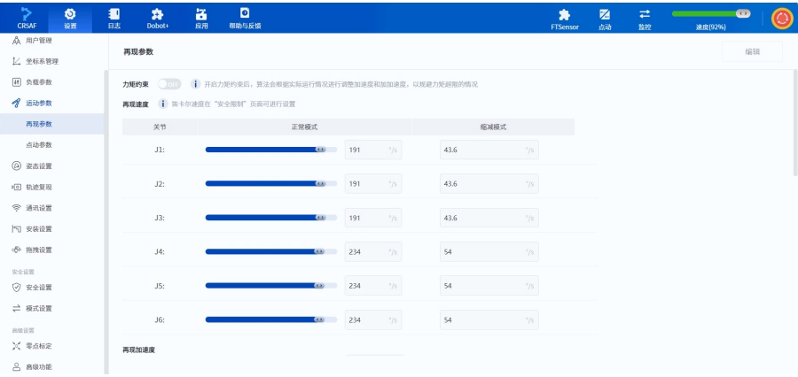
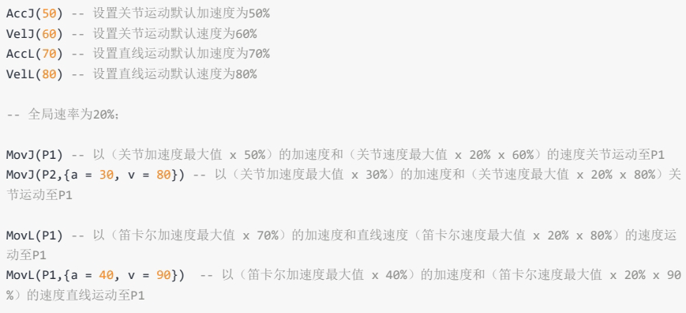

# Arm Secondary Development MD Documentation - Part Four

## 2.6 Bus Register Related Commands

# Command List

Bus register commands are used to read and write Profinet or Ethernet/IP bus registers.

| **Command**     | **Function**                 | **Command Type** |
| -------------- | -------------------------- | ------------ |
| GetInputBool   | Get bool value at specified address of input register  | Immediate Command |
| GetInputInt    | Get int value at specified address of input register   | Immediate Command |
| GetInputFloat  | Get float value at specified address of input register | Immediate Command |
| GetOutputBool  | Get bool value at specified address of output register  | Immediate Command |
| GetOutputInt   | Get int value at specified address of output register   | Immediate Command |
| GetOutputFloat | Get float value at specified address of output register | Immediate Command |
| SetOutputBool  | Set bool value at specified address of output register  | Immediate Command |
| SetOutputInt   | Set int value at specified address of output register   | Immediate Command |
| SetOutputFloat | Set float value at specified address of output register | Immediate Command |

# GetInputBool

# Prototype:

```
GetInputBool(address)
```

# Description:

Get the bool type value at the specified address of the input register.

# Required Parameters

| **Parameter Name** | **Type** | **Description**               |
| ------- | ------ | --------------------- |
| address | int    | Register address, range: \[0,63]. |

# Return

```
ErrorID,{value},GetInputBool(address);
```

value represents the value at the specified register address, which is 0 or 1.

# Example:

```
GetInputBool(0)
```

Read the boolean value at input register address 0.

# GetInputInt

# Prototype:

```
GetInputInt(address)
```

# Description:

Get the int type value at the specified address of the input register.

# Required Parameters

| **Parameter Name** | **Type** | **Description**               |
| ------- | ------ | --------------------- |
| address | int    | Register address, range: \[0,23]. |

# Return

```
ErrorID, {value}, GetInputInt(address);
```

value represents the value at the specified register address, which is an integer (int32).

# Example:

```
GetInputInt(1)
```

Read the int value at input register address 1.

# GetInputFloat

# Prototype:

```
GetInputFloat(address)
```

# Description:

Get the float type value at the specified address of the input register.

# Required Parameters

| **Parameter Name** | **Type** | **Description**               |
| ------- | ------ | --------------------- |
| address | int    | Register address, range: \[0,23]. |

# Return

```
ErrorID,{value},GetInputFloat(address);
```

value represents the value at the specified register address, which is a single-precision floating-point number (float).

# Example:

```
GetInputFloat(2)
```

Read the float value at input register address 2.

# GetOutputBool

# Prototype:

```
GetOutputBool(address)
```

# Description:

Get the bool type value at the specified address of the output register.

# Required Parameters

| **Parameter Name** | **Type** | **Description**               |
| ------- | ------ | --------------------- |
| address | int    | Register address, range: \[0,63]. |

# Return

```
ErrorID, {value}, GetOutputBool(address);
```

value represents the value at the specified register address, which is 0 or 1.

# Example:

```
GetOutputBool(0)
```

Get the boolean value at output register address 0.

# GetOutputInt

# Prototype:

```
GetOutputInt(address)
```

# Description:

Get the int type value at the specified address of the output register.

# Required Parameters

| **Parameter Name** | **Type** | **Description**               |
| ------- | ------ | --------------------- |
| address | int    | Register address, range: \[0,23]. |

# Return

```
ErrorID, {value}, GetOutputInt(address);
```

value represents the value at the specified register address, which is an integer (int32).

# Example:

```
GetOutputInt(1)
```

Read the int value at output register address 1.

# GetOutputFloat

# Prototype:

```
GetOutputFloat(address)
```

# Description:

Get the float type value at the specified address of the output register.

# Required Parameters

| **Parameter Name** | **Type** | **Description**               |
| ------- | ------ | --------------------- |
| address | int    | Register address, range: \[0,23]. |

# Return

```
ErrorID, {value}, GetOutputFloat(address);
```

value represents the value at the specified register address, which is a single-precision floating-point number (float).

# Example:

```
GetOutputFloat(2)
```

Read the float value at output register address 2.

# SetOutputBool

# Prototype:

```
SetOutputBool(address,value)
```

# Description:

Set the bool type value at the specified address of the output register.

# Required Parameters

| **Parameter Name** | **Type** | **Description**               |
| ------- | ------ | --------------------- |
| address | int    | Register address, range: \[0,63]. |
| value   | int    | Value to set, supports 0 or 1.         |

# Return

```
ErrorID, {},SetOutputBool(address, value);
```

# Example:

```
SetOutputBool(0,0)
```

Set the value of output register 0 to false.

# SetOutputInt

# Prototype:

```
SetOutputInt(address,value)
```

# Description:

Set the int type value at the specified address of the output register.

# Required Parameters

| **Parameter Name** | **Type** | **Description**               |
| ------- | ------ | --------------------- |
| address | int    | Register address, range: \[0,23]. |
| value   | int    | Value to set, supports signed 32-bit integer.  |

# Return

```
ErrorID, {}, SetOutputInt(address, value);
```

# Example:

```
SetOutputInt(1,123)
```

Set the value at output register address 1 to 123.

# SetOutputFloat

# Prototype:

```
SetOutputFloat(address, value)
```

# Description:

Set the float type value at the specified address of the output register.

# Required Parameters

| **Parameter Name** | **Type** | **Description**               |
| ------- | ------ | --------------------- |
| address | int    | Register address, range: \[0,23]. |
| value   | float  | Value to set, supports single-precision floating-point number.      |

# Return

```
ErrorID, {}, SetOutputFloat(address, value);
```

# Example:

```
SetOutputFloat(2,12.3)
```

Set the float value at output register address 2 to 12.3.

## 2.7 Motion Related Commands

# Parameter Format

In motion commands, point parameters and optional parameters are of string type, in the format "key=value", for example "joint = \{10, 10, 10, 0, 0, 0}", "user=1". For user convenience in understanding parameters, the type column for such parameters in the parameter tables below indicates the type of the value.

# Motion Types

The motion types supported by the robot can be divided into the following categories.

# Joint Motion

The robot plans the motion of each joint based on the difference between the current joint angles and the target point joint angles, so that each joint completes motion simultaneously. Joint motion does not constrain the TCP (Tool Center Point) trajectory, and generally this trajectory is not a straight line.

Current point P1

Joint motion is not affected by singular positions (see the corresponding robot hardware manual for details on singular point positions), so if there are no requirements for the motion trajectory, or the target point is near a singular position, joint motion is recommended.

# Linear Motion

The robot plans the motion trajectory based on the current pose and the target point pose, so that the TCP trajectory is a straight line, and the end-effector attitude changes uniformly during the motion.

Current point P1

When the motion trajectory passes through a singular position, sending a linear motion command to the robot will produce an error. It is recommended to replan the point positions or use joint motion near the singular position.

# Arc Motion

The robot determines an arc or complete circle through three non-collinear points: the current position, P1, and P2. The end-effector attitude during the motion is calculated through interpolation from the current point and P2 point attitudes. The P1 point attitude does not participate in the calculation (i.e., the attitude when the robot reaches P1 during the motion may be different from the taught attitude).

P1P1P2P2Current pointCurrent point

When the motion trajectory passes through a singular position, sending an arc motion command to the robot will produce an error. It is recommended to replan the point positions or use joint motion near the singular position.

# Point Parameters

Unless otherwise specified, all point parameters (P) in motion commands support two expression methods:

● Joint Variables: Use the angles of each robot joint (j1~j6) to represent the target point position. When used as a target point, it will be converted to pose variables through forward kinematics.

```
joint = {j1, j2, j3, j4, j5, j6}
```

● Pose Variables: Use Cartesian coordinates (x, y, z) to represent the spatial position of the target point in the user coordinate system, and use Euler angles (rx, ry, rz) to represent the rotation angle of the tool coordinate system relative to the user coordinate system when the TCP (Tool Center Point) reaches that point.

The rotation order for Dobot robot Euler angle calculation is $X \to Y \to Z$, where each axis rotates around a fixed axis (user coordinate system), as shown in the figure below ($rx=\gamma$, $ry=\beta$, $rz=\alpha$).

2b2PBAC-8RA日B

After determining the rotation order, the rotation matrix can be derived (where $\text{ca}$ is shorthand for $\cos\alpha$, $\text{sa}$ is shorthand for $\sin\alpha$, and so on)

​$\begin{aligned} \begin{bmatrix} \Lambda_B R_{XYZ}(\gamma, \beta, \alpha) &= R_Z(\alpha)R_\gamma(\beta)R_X(\gamma) \\ &= \begin{bmatrix} c\alpha & -s\alpha & 0 \\ s\alpha & c\alpha & 0 \\ 0 & 0 & 1 \end{bmatrix} \begin{bmatrix} c\beta & 0 & s\beta \\ 0 & 1 & 0 \\ -s\beta & 0 & c\beta \end{bmatrix} \begin{bmatrix} 1 & 0 & 0 \\ 0 & c\gamma & -s\gamma \\ 0 & s\gamma & c\gamma \end{bmatrix} \end{aligned}$​

The equation is derived as

​$A_B^A R_{XYZ}(\gamma, \beta, \alpha) = \begin{bmatrix} c \alpha c \beta & c \alpha s \beta s \gamma - s \alpha c \gamma & c \alpha s \beta c \gamma + s \alpha s \gamma \\ s \alpha c \beta & s \alpha s \beta s \gamma + c \alpha c \gamma & s \alpha s \beta c \gamma - c \alpha s \gamma \\ -s \beta & c \beta s \gamma & c \beta c \gamma \end{bmatrix}$​

The robot end-effector attitude is calculated using this equation.

pose = \{x, y, z, rx, ry, rz}

# Coordinate System Parameters

For Cartesian coordinate system related motion commands, the optional parameters user and tool are used to specify the user and tool coordinate systems of the target point:

Currently, only specification by index number is supported, and the corresponding coordinate system needs to be added in the control software first.

If the user and tool parameters are not included, the global user and tool coordinate systems are used. See the user and tool command descriptions in the settings-related commands for details (the default coordinate system when no command is called is 0).

# Motion Parameters

# Relative Speed

The optional parameters a and v are used to specify the acceleration and speed ratios when the robot executes this motion command.

Robot actual motion speed = Maximum speed × Global speed ratio × Command speed ratio

Robot actual motion acceleration = Maximum acceleration × Command speed ratio

Where the maximum speed/acceleration is controlled by playback parameters, and can be viewed and modified in the motion parameters page of DobotStudio Pro.

> 2CRSAF日设置Dobot+帮助与反馈监控FTScnsor点动速度(92%)用户管理再现参数编辑坐标系管理负载参数力矩约东开启力矩约束后，算法会根据实际运行情况进行调整加速度和加加速度，以规避力矩超限的情况运动参数笛卡尔速度在"安全限制"页面可进行设置再现速度再现参数关节正常模式缩减模式点动参数J1:19143.615/5姿态设置J2:19143.6\*/s轨迹复现通讯设置J3:19143.60/s安装设置抱拽设置J4:54234安全设置J5:5423安全设置模式设置2J6:54234\*/s高级设置X零点标定再现加速度高级功能
>
> 
>
> ​

The global speed ratio can be set through DobotStudio Pro (top right corner of the above image) or the SpeedFactor command.

The command speed ratio is the ratio carried by the optional parameter of the motion command. When the motion acceleration/speed ratio is not specified through the optional parameter, the value set in the motion parameters is used by default (see the VelJ, AccJ, VelL, AccL commands for details; the default value when no command is called is 100).



​

Example:

```
AccJ(50) --Set joint motion default acceleration to 50%
VelJ(60) --Set joint motion default speed to 60%
AccL(70) --Set linear motion default acceleration to 70%
VelL(80) --Set linear motion default speed to 80%
--Global speed ratio is 20%;
MovJ(P1)--Joint motion to P1 with (joint maximum acceleration×50%) acceleration and (joint maximum speed×20%×60%) speed
MovJ(P2,{a=30,v=80})--Joint motion to P2 with (joint maximum acceleration×30%) acceleration and (joint maximum speed×20%×80%) speed
MovL(P1)--Linear motion to P1 with (Cartesian maximum acceleration×70%) acceleration and (Cartesian maximum speed×20%×80%) speed
MovL(P1,{a=40,v=90})--Linear motion to P1 with (Cartesian maximum acceleration×40%) acceleration and (Cartesian maximum speed×20% × 90%) speed
```

# Absolute Speed

The optional parameter speed in linear and arc motion commands is used to specify the absolute speed when the robot arm executes this motion command.

The absolute speed is not affected by the global speed ratio, but is limited by the maximum speed in the playback parameters (if the robot has entered reduced mode, it is limited by the reduced maximum speed). That is, if the target speed set by the speed parameter is greater than the maximum speed in the playback parameters, the maximum speed is used as the standard.

Example:

```
MovL(P1, {speed = 1000}) -- Linear move to P1 at an absolute speed of 1000
```

MovL sets speed to 1000, which is less than the maximum speed of 2000 in the playback parameters, so the robot will move with 1000mm/s as the target speed, and this target speed is independent of the current global speed ratio. However, if the robot is in reduced mode (assuming the reduction rate is 10%), the maximum speed becomes 200, which is less than 1000, so the robot will move with 200mm/s as the target speed.

The speed parameter and v parameter are mutually exclusive. If both exist, speed takes precedence.

# Smoothing Transition Parameters

When the robot moves continuously through multiple points, it can pass through intermediate points via smoothing transition to avoid the robot turning too abruptly. If the user specifies several path points based on different tool coordinate systems, smoothing transition is not possible.

The optional parameters cp or r are used to specify the smoothing transition ratio (cp) or smoothing transition radius (r) between the current motion command and the next motion command. They are mutually exclusive. If both exist, r takes precedence.

# Note:

Joint motion related commands do not support setting the smoothing transition radius (r). See the optional parameters of each command for details.

When setting the smoothing transition ratio, the system will automatically calculate the arc of the transition curve. The larger the CP value, the smoother the curve, as shown in the figure below. The CP transition curve is affected by motion speed/acceleration. Even if the point position and CP value are the same, the arc of the transition curve will be different with different motion speed/acceleration.

CP=0P2CP=50%CP=100%P1P3

When setting the smoothing transition radius, the system will use the transition point as the center and calculate the transition curve based on the specified radius. The R transition curve is not affected by motion speed/acceleration, and is only determined by the point position and transition radius.

P2P1Transition curveP3

If the user-set transition radius is too large (exceeding the distance between the start point/end point and the transition point), the system will automatically use half of the shorter distance between the start point/end point and the transition point as the transition radius to calculate the transition curve.

The user-set r that actually takes effect

When the smoothing transition ratio or radius is not specified through the optional parameter, the smoothing transition ratio set in the motion parameters is used by default (see the CP command for details; the default value when no command is called is 0).

# Note:

Smoothing transition causes the robot motion to not pass through intermediate points. Therefore, when smoothing transition is set, IO signal output or function setting commands (such as enabling/disabling the safety skin) between two motion commands will be executed during the transition process.

If you want to execute commands when the robot precisely reaches the intermediate point, set the smoothing transition parameter of the previous command to 0.

# Command List

| **Command**          | **Function**              | **Command Type** |
| ------------------- | --------------- | ------------ |
| MovJ                | Joint motion            | Queue Command     |
| MovL                | Linear motion            | Queue Command     |
| MovLIO              | Linear motion with DO output       | Queue Command     |
| MovJIO              | Joint motion with DO output       | Queue Command     |
| Arc                 | Arc interpolation motion          | Queue Command     |
| ArcIO               | Arc motion with DO output       | Queue Command     |
| Circle              | Full circle interpolation motion          | Queue Command     |
| ServoJ              | Dynamic following command based on joint space   | Queue Command     |
| ServoP              | Dynamic following command based on Cartesian space  | Queue Command     |
| MoveJog             | Jog the robot arm           | Immediate Command |
| RunTo               | Move to specified point position         | Immediate Command |
| GetStartPose        | Get the first point of specified trajectory    | Immediate Command |
| MovS                | Fit imported trajectory         | Queue Command     |
| StartPath           | Reproduce recorded motion trajectory       | Queue Command     |
| RelMovJTool         | Relative joint motion along tool coordinate system  | Queue Command     |
| RelMovLTool         | Relative linear motion along tool coordinate system  | Queue Command     |
| RelMovJUser         | Relative joint motion along user coordinate system  | Queue Command     |
| RelMovLUser         | Relative linear motion along user coordinate system  | Queue Command     |
| RelJointMovJ        | Relative joint motion along joint coordinate system  | Queue Command     |
| RelPointTool        | Cartesian point offset along tool coordinate system    | Immediate Command |
| RelPointUser        | Cartesian point offset along user coordinate system    | Immediate Command |
| RelJoint            | Joint point offset          | Immediate Command |
| GetCurrentCommandID | Get algorithm queue ID of currently executing command | Immediate Command |
| StartRTOffset       | Start coordinate system offset         | Queue Command     |
| EndRTOffset         | End coordinate system offset         | Queue Command     |
| OffsetPara          | Set coordinate system offset value        | Immediate Command |

# MovJ

# Prototype

MovJ(P, user, tool, a, v, cp)

# Description

Move from the current position to the target point using joint motion.

# Required Parameters

| **Parameter Name** | **Type** | **Description**                                                                                      |
| ------- | ------ | ------------------------------------------------------------------------------------------- |
| p       | string | Target point, supports joint variables or pose variables. Format is "joint = \{j1, j2, j3, j4, j5, j6}" or "pose = \{x, y, z, rx, ry, rz}". |

# Optional Parameters

| **Parameter Name** | **Type** | **Description**                                               |
| ------- | ------ | ----------------------------------------------------- |
| user    | string | Format is "user=index", index is the calibrated user coordinate system index. Range: \[0,50].      |
| tool    | string | Format is "tool=index", index is the calibrated tool coordinate system index. Range: \[0,50].      |
| a       | string | Format is "a=value". Value represents the robot motion acceleration ratio when executing this command. Range: \[1,100]. |
| v       | string | Format is "v=value". Value represents the robot motion speed ratio when executing this command. Range: \[1,100].  |
| cp      | string | Format is "cp=value". Value represents the smoothing transition ratio. Range: \[0,100].            |

# Return

```
ErrorID,{ResultID},MovJ(P,user,tool,a,v,cp);
```

ResultID is the algorithm queue ID, which can be used to determine the command execution order.

# Example

```
MovJ(pose={-500,100,200,150,0,90},user=1,tool=0, a=20, v=50, cp=100)
```

The robot moves from the current position to Cartesian coordinate point \{-500,100,200,150,0,90} (user coordinate system 1, tool coordinate system 0) at 50% speed, 20% acceleration, and 100% smoothing transition ratio using joint motion.

# MovL

# Prototype

```
MovL(P,user,tool,a,v|speed,cp|r)
```

# Description

Move from the current position to the target point using linear motion.

# Required Parameters

| **Parameter Name** | **Type** | **Description**                                                                                  |
| ------- | ------ | ---------------------------------------------------------------------------------------- |
| P       | string | Target point, supports joint variables or pose variables. Format is "joint = \{j1, j2, j3, j4, j5, j6}" or "pose = \{x, y, z, rx, ry, rz}". |

# Optional Parameters

| **Parameter Name** | **Type** | **Description**                                                                                   |
| ------- | ------ | ----------------------------------------------------------------------------------------- |
| user    | string | Format is "user=index", index is the calibrated user coordinate system index. Range: \[0,50].                                         |
| tool    | string | Format is "tool=index", index is the calibrated tool coordinate system index. Range: \[0,50].                                         |
| a       | string | Format is "a=value". Value represents the robot motion acceleration ratio when executing this command. Range: \[1,100].                                    |
| v       | string | Format is "v=value". Value represents the robot motion speed ratio when executing this command, mutually exclusive with speed. Range: \[1,100].                            |
| speed   | string | Format is "speed=value". Value represents the robot motion target speed when executing this command, mutually exclusive with v, if both exist, speed takes precedence. Range: \[1, maximum motion speed], unit: mm/s. |
| cp      | string | Format is "cp=value". Value represents the smoothing transition ratio, mutually exclusive with r. Range: \[0,100].                                          |
| r       | string | Format is "r=value". Value represents the smoothing transition radius, mutually exclusive with cp. If both exist, r takes precedence. Unit: mm.                                        |

# Return

```
ErrorID, {ResultID}, MovL(P, user, tool, a, v| speed, cp|r);
```

ResultID is the algorithm queue ID, which can be used to determine the command execution order.

# Example

```
MovL (pose={-500,100,200,150,0,90}, v=60)
```

The robot moves from the current position to Cartesian coordinate point \{-500,100,200,150,0,90} at 60% speed using linear motion.

# MovLIO

# Prototype

```
MovLIO(P,{Mode,Distance,Index,Status},...,{Mode,Distance,Index,Status},user,tool,a,v|speed,cp|r)
```

# Description

Move from the current position to the target point using linear motion, while setting digital output port status in parallel during the motion.

# Required Parameters

| **Parameter Name** | **Type** | **Description**                                                                                  |
| ------- | ------ | ---------------------------------------------------------------------------------------- |
| P       | string | Target point, supports joint variables or pose variables. Format is "joint = \{j1, j2, j3, j4, j5, j6}" or "pose = \{x, y, z, rx, ry, rz}". |

\{Mode,Distance,Index,Status} are parallel digital output parameters, used to set when the robot moves to a specified distance or percentage, trigger the specified DO. Multiple groups can be set, with a minimum of one group of data. The specific meanings of the parameters are as follows:

| **Parameter Name** | **Type** | **Description**                                                                                                                                                                          |
| -------- | ------ | ------------------------------------------------------------------------------------------------------------------------------------------------------------------------------- |
| Mode     | int    | Set trigger mode. 0: percentage trigger 1: distance trigger                                                                                                                                                      |
| Distance | int    | Run the specified distance. When Mode is 0, Distance represents the percentage of the distance between the start point and the target point; range: (0,100). When Mode is 1, Distance represents the distance from the start point or target point; unit: mm. When Distance is 0, it means trigger at the start point. When Distance is a positive number, it represents the percentage/distance from the start point. When Distance is a negative number, it represents the percentage/distance from the target point. |
| Index    | int    | DO terminal number. Range: \[1,24] or \[100,1000]. When the range is \[100,1000], hardware support for the expansion IO module is required. The range varies depending on the model.                                                                                            |
| Status   | int    | DO status to set, 0 means no signal (DO off), 1 means signal present (DO on).                                                                                                                                         |

# Optional Parameters

| **Parameter Name** | **Type** | **Description**                                                                                |
| ------- | ------ | -------------------------------------------------------------------------------------- |
| user    | string | Format is "user=index", index is the calibrated user coordinate system index. Range: \[0,50].                                       |
| tool    | string | Format is "tool=index", index is the calibrated tool coordinate system index. Range: \[0,50].                                       |
| a       | string | Format is "a=value". Value represents the robot motion acceleration ratio when executing this command. Range: \[1,100].                                  |
| v       | string | Format is "v=value". Value represents the robot motion speed ratio when executing this command, mutually exclusive with speed. Range: \[1,100].                          |
| speed   | string | Format is "speed=value". Value represents the robot motion target speed when executing this command, mutually exclusive with v, if both exist, speed takes precedence. Range: \[1, maximum motion speed], unit: mm/s. |
| cp      | string | Format is "cp=value". Value represents the smoothing transition ratio, mutually exclusive with r. Range: \[0,100].                                        |
| r       | string | Format is "r=value". Value represents the smoothing transition radius, mutually exclusive with cp, if both exist, r takes precedence. Unit: mm.                                      |

# Return

```
ErrorID, {ResultID}, MovLIO(P, {Mode, Distance, Index, Status}, ..., {Mode, Distance, Index, Status}, user, tool, a, v | speed, cp | r);
```

ResultID is the algorithm queue ID, which can be used to determine the command execution order.

# Example 1

​$\text{MovLIO}(\text{pose}=\{-500,100,200,150,0,90\},\{\text{0},\text{30},\text{2},\text{1}\})$​

The robot moves from the current position to Cartesian coordinate point \{-500,100,200,150,0,90} using linear motion. When it reaches 30% of the distance from the start point, set DO2 to ON.

Current pointP1DO2=ON30%

# Example 2

​$\text{MovLIO}(\text{pose}=\{-500,100,200,150,0,90\},\{ 1,\ -15,\ 3,\ \emptyset\})$​

The robot moves from the current position to Cartesian coordinate point \{-500,100,200,150,0,90} using linear motion. When it reaches 15mm from the end point, set DO3 to OFF.

P1Current pointDO3=OFF15mm

# MovJIO

# Prototype

```
MovJIO(P,{Mode,Distance,Index,Status},...,{Mode,Distance,Index,Status},user,tool,a,v,cp)
```

# Description

Move from the current position to the target point using joint motion, while setting digital output port status in parallel during the motion.

# Required Parameters

| **Parameter Name** | **Type** | **Description**                                                                                  |
| ------- | ------ | ---------------------------------------------------------------------------------------- |
| P       | string | Target point, supports joint variables or pose variables. Format is "joint = \{j1, j2, j3, j4, j5, j6}" or "pose = \{x, y, z, rx, ry, rz}". |

\{Mode,Distance,Index,Status} are parallel digital output parameters, used to set when the robot moves to a specified distance or percentage, trigger the specified DO. Multiple groups can be set, with a minimum of one group of data. The specific meanings of the parameters are as follows:

| **Parameter Name** | **Type** | **Description**                                                                                                                                                                          |
| -------- | ------ | ------------------------------------------------------------------------------------------------------------------------------------------------------------------------------- |
| Mode     | int    | Set trigger mode. 0: percentage trigger 1: distance trigger                                                                                                                                                      |
| Distance | int    | Run the specified distance. When Mode is 0, Distance represents the percentage of the distance between the start point and the target point; range: (0,100). When Mode is 1, Distance represents the distance from the start point or target point; unit: mm. When Distance is 0, it means trigger at the start point. When Distance is a positive number, it represents the percentage/distance from the start point. When Distance is a negative number, it represents the percentage/distance from the target point. |
| Index    | int    | DO terminal number. Range: \[1,24] or \[100,1000]. When the range is \[100,1000], hardware support for the expansion IO module is required. The range varies depending on the model.                                                                                            |
| Status   | int    | DO status to set, 0 means no signal (DO off), 1 means signal present (DO on).                                                                                                                                         |

# Optional Parameters

| **Parameter Name** | **Type** | **Description**                                                |
| ------- | ------ | ------------------------------------------------------ |
| user    | string | Format is "user=index", index is the calibrated user coordinate system index. Range: \[0,50].      |
| tool    | string | Format is "tool=index", index is the calibrated tool coordinate system index. Range: \[0,50].      |
| a       | int    | Format is "a=value". Value represents the robot motion acceleration ratio when executing this command. Range: \[1,100]. |
| v       | int    | Format is "v=value". Value represents the robot motion speed ratio when executing this command. Range: \[1,100].  |
| cp      | int    | Format is "cp=value". Value represents the smoothing transition ratio. Range: \[0,100].            |

# Return

```
ErrorID, {ResultID}, MovJIO(P, {Mode, Distance, Index, Status}, ..., {Mode, Distance, Index, Status}, user, tool, a, v, cp);
```

ResultID is the algorithm queue ID, which can be used to determine the command execution order.

# Example 1

​$\text{MovJIO}(\text{pose}=\{-500,100,200,150,0,90\},\{0,30,2,1\})$​

The robot moves from the current position to Cartesian coordinate point \{-500,100,200,150,0,90} using joint motion. When it reaches 30% of the distance from the start point, set DO2 to ON.

P1Current point(Joint angle composition(Joint angle compositionDO2=ON30%

# Example 2

​$\text{MovJIO}(\text{pose}=\{-500,100,200,150,0,90\},\{ 1,\ -15,\ 3,\ 0\})$​

The robot moves from the current position to Cartesian coordinate point \{-500,100,200,150,0,90} using joint motion. When it reaches 15° from the end point, set DO3 to OFF.

P1Current point(Joint angle composition(Joint angle compositionDO3=OFF150

# Arc

# Prototype

```
Arc(P1,P2,user,tool,a,v|speed,cp|r,mode)
```

# Description

Move from the current position to the target point using arc interpolation.

Three points are needed to determine an arc: the current position, the arc intermediate point, and the motion target point. Therefore, the current position cannot be on the line determined by P1 and P2.

P1Current pointP2

The end-effector attitude during the motion is calculated through interpolation from the current point and P2 point attitudes. The P1 point attitude does not participate in the calculation (i.e., the attitude when the robot arm reaches P1 during the motion may be different from the taught attitude).

# Required Parameters

| **Parameter Name** | **Type** | **Description**                                                                                       |
| ------- | ------ | --------------------------------------------------------------------------------------------- |
| P1      | string | Arc intermediate point, supports joint variables or pose variables. Format is "joint = \{j1, j2, j3, j4, j5, j6}" or "pose = \{x, y, z, rx, ry, rz}". |
| P2      | string | Motion target point, supports joint variables or pose variables. Format is "joint = \{j1, j2, j3, j4, j5, j6}" or "pose = \{x, y, z, rx, ry, rz}". |

# Optional Parameters

| **Parameter Name** | **Type** | **Description**                                                                                                                                                                                                                                                                                                                           |
| ------- | ------ | -------------------------------------------------------------------------------------------------------------------------------------------------------------------------------------------------------------------------------------------------------------------------------------------------------------------------------- |
| user    | string | Format is "user=index", index is the calibrated user coordinate system index. Range: \[0,50].                                                                                                                                                                                                                                                                                |
| tool    | string | Format is "tool=index", index is the calibrated tool coordinate system index. Range: \[0,50].                                                                                                                                                                                                                                                                                |
| a       | string | Format is "a=value". Value represents the robot motion acceleration ratio when executing this command. Range: \[1,100].                                                                                                                                                                                                                                                                           |
| v       | string | Format is "v=value". Value represents the robot motion speed ratio when executing this command. Range: \[1,100].                                                                                                                                                                                                                                                                            |
| speed   | string | Format is "speed=value". Value represents the robot motion target speed when executing this command, mutually exclusive with v, if both exist, speed takes precedence. Range: \[1, maximum motion speed], unit: mm/s.                                                                                                                                                                                                                                        |
| cp      | string | Format is "cp=value". Value represents the smoothing transition ratio, mutually exclusive with r. Range: \[0,100].                                                                                                                                                                                                                                                                                 |
| r       | string | Format is "r=value". Value represents the smoothing transition radius, mutually exclusive with cp, if both exist, r takes precedence. Unit: mm. Smoothing transition will change the robot motion trajectory and affect the timing of DO output, use with caution.                                                                                                                                                                                                                                              |
| mode    | int    | Format is "mode=value". By setting attitude control parameters, the robot's attitude relative to the arc during interpolation is adaptively controlled to meet the usage requirements of different scenarios. Range: \[0,2]. • mode=0: Linear mode. Interpolate from current attitude to P2 target pose, ignoring P1 attitude. In this mode, only attitude changes less than $180^{\circ}$ can be achieved. Suitable for occasions with no requirements on robot attitude. • mode=1: Pass through intermediate point mode. Starting from current attitude, pass through intermediate point pose, interpolate to P2 target pose. Mainly used in welding applications. • mode=2: Fixed mode. Starting from current attitude, TCP maintains a constant direction relative to the arc tangent, ignoring P1 and P2 attitudes. In this mode, the attitude rotation angle is consistent with the arc angle, and attitude changes greater than $180^{\circ}$ can be achieved. Mainly used in applications such as dispensing and polishing. |

P2P2P2P1P1P1Current PoseCurrent PoseCurrent PoseLinear modePass through intermediate point modeFixed modeTaught attitudeActual trajectory attitude

# Note:

· When set to mode=1 (pass through intermediate point mode), to ensure the uniformity of arc motion speed, when teaching the arc trajectory, try to ensure the intermediate point position is at the middle of the actual arc.

●When set to mode=1 (pass through intermediate point mode), it is necessary to appropriately adjust the attitude of each point to ensure the attitude change from the starting point to the intermediate point is close to the attitude change from the intermediate point to the target point. Otherwise, the constructed attitude curve may exceed the robot's reachable range, and an error will be reported during operation.

# Return

```
ErrorID,{ResultID},Arc(P1,P2,user,tool,a,v|speed,cp|r,mode);
```

ResultID is the algorithm queue ID, which can be used to determine the command execution order.

# Example

```
Arc(pose={-350,-200,200,150,0,90},pose={-300,-250,200,150,0,90})
```

The robot moves from the current position to Cartesian coordinate point \{-300,-250,200,150,0,90} via Cartesian coordinate point \{-350,-200,200,150,0,90} using arc motion.

# ArcIO

# Prototype:

```
ArcIO(P1,P2,{Mode,Distance,Index,Status},...,{Mode,Distance,Index,Status},user,tool,a,v|speed,
cp|r,mode)
```

# Description:

Output specified DO signals in parallel during arc interpolation. Suitable for dispensing application scenarios, controlling the early dispensing and early stopping of the dispensing head (e.g., speaker dispensing, where the trajectory is mainly arcs).

Three points are needed to determine an arc: the current point, P1, and P2. Therefore, the current position cannot be on the line determined by P1 and P2.

P1P2Current point

# Required Parameters:

| **Parameter Name** | **Type** | **Description**                                                                                     |
| ------- | ------ | ------------------------------------------------------------------------------------------ |
| P1      | string | Arc intermediate point, supports joint variables or pose variables. Format is "joint = \{j1, j2, j3, j4, j5, j6}" or "pose = \{x, y, z, rx, ry, rz}". |
| P2      | string | Motion target point, supports joint variables or pose variables. Format is "joint = \{j1, j2, j3, j4, j5, j6}" or "pose = \{x, y, z, rx, ry, rz}". |

\{Mode,Distance,Index,Status} are parallel digital output parameters, used to set when the robot moves to a specified distance or percentage, trigger the specified DO. Multiple groups can be set, with a minimum of one group of data. The specific meanings of the parameters are as follows:

| **Parameter Name** | **Type** | **Description**                                                                                                                                                                          |
| -------- | ------ | ------------------------------------------------------------------------------------------------------------------------------------------------------------------------------- |
| Mode     | int    | Set trigger mode. 0: percentage trigger 1: distance trigger                                                                                                                                                      |
| Distance | int    | Run the specified distance. When Mode is 0, Distance represents the percentage of the distance between the start point and the target point; range: (0,100). When Mode is 1, Distance represents the distance from the start point or target point; unit: mm. When Distance is 0, it means trigger at the start point. When Distance is a positive number, it represents the percentage/distance from the start point. When Distance is a negative number, it represents the percentage/distance from the target point. |
| Index    | int    | DO terminal number. Range: \[1,24] or \[100,1000]. When the range is \[100,1000], hardware support for the expansion IO module is required. The range varies depending on the model.                                                                                            |
| Status   | int    | DO status to set, 0 means no signal (DO off), 1 means signal present (DO on).                                                                                                                                         |

# Optional Parameters:

| **Parameter Name** | **Type** | **Description**                                                                                                                                                                                                                                                                                               |
| ------- | ------ | ---------------------------------------------------------------------------------------------------------------------------------------------------------------------------------------------------------------------------------------------------------------------------------------------------- |
| user    | string | Format is "user=index", index is the calibrated user coordinate system index. Range: \[0,50].                                                                                                                                                                                                                                                     |
| tool    | string | Format is "tool=index", index is the calibrated tool coordinate system index. Range: \[0,50].                                                                                                                                                                                                                                                     |
| a       | string | Format is "a=value". Value represents the robot motion acceleration ratio when executing this command. Range: \[1,100].                                                                                                                                                                                                                                                |
| v       | string | Format is "v=value". Value represents the robot motion speed ratio when executing this command. Range: \[1,100].                                                                                                                                                                                                                                                 |
| speed   | string | Format is "speed=value". Value represents the robot motion target speed when executing this command, mutually exclusive with v, if both exist, speed takes precedence. Range: \[1, maximum motion speed], unit: mm/s.                                                                                                                                                                                                               |
| cp      | string | Format is "cp=value". Value represents the smoothing transition ratio, mutually exclusive with r. Range: \[0,100].                                                                                                                                                                                                                                                      |
| r       | string | Format is "r=value". Value represents the smoothing transition radius, mutually exclusive with cp, if both exist, r takes precedence. Unit: mm. Smoothing transition will change the robot motion trajectory and affect the timing of DO output, use with caution.                                                                                                                                                                                                                  |
| mode    | int    | Format is "mode=value". By setting attitude control parameters, the robot's attitude relative to the arc during interpolation is adaptively controlled to meet the usage requirements of different scenarios. Range: \[0,2].mode=0:Linear mode. Interpolate from current attitude to P2 target pose, ignoring P1 attitude. In this mode, only attitude changes less than 180° can be achieved. Suitable for occasions with no requirements on robot attitude.mode=1:Pass through intermediate point mode. Starting from current attitude, pass through intermediate point pose, interpolate to P2 target pose. Mainly used in welding applications.mode=2:Fixed mode. Starting from current attitude, TCP maintains a constant direction relative to the arc tangent, ignoring P1 and P2 attitudes. In this mode, the attitude rotation angle is consistent with the arc angle, and attitude changes greater than 180° can be achieved. Mainly used in applications such as dispensing and polishing. |

P2P2P2P1P1P1Current PoseCurrent PoseCurrent PoseLinear modePass through intermediate point modeFixed modeTaught attitudeActual trajectory attitude

# Note:

●When set to mode=1 (pass through intermediate point mode), to ensure the uniformity of arc motion speed, when teaching the arc trajectory, try to ensure the intermediate point position is at the middle of the actual arc.

● When set to mode=1 (pass through intermediate point mode), it is necessary to appropriately adjust the attitude of each point to ensure the attitude change from the starting point to the intermediate point is close to the attitude change from the intermediate point to the target point. Otherwise, the constructed attitude curve may exceed the robot's reachable range, and an error will be reported during operation.

# ▲Note:

If Mode is 0 and Distance is not within \[0,100] range, a parameter out-of-range error will be reported.

# Example:

```
ArcIO(pose={-1140.580322,-31.398853,93.642189,10.629999,21.659998,-86.040001},pose={-1220.2070,31,-281.265533,93.642189,10.629999,21.659998,-86.040001},{0,25,1,1},{0,50,2,1},{0,75,3,1},{0,1,00,4,1},user=1,tool=2,a=20,v=50,cp=100)
```

The robot arm moves from the current position via intermediate point P1 to target point P2 in arc motion. When it reaches 25% of the distance from the start point, set DO1 to ON. When it reaches 50% of the distance from the start point, set DO2 to ON. When it reaches 75% of the distance from the start point, set DO3 to ON. When it reaches the end point, set DO4 to ON.

# Circle

# Prototype

```
Circle(P1,P2,count,user,tool,a,v|speed,cp|r,mode)
```

# Description

Perform full circle interpolation motion from the current position, returning to the current position after the specified number of revolutions.

Three points are needed to determine a full circle: the current position, P1, and P2. Therefore, the current position cannot be on the line determined by P1 and P2, and the full circle determined by the three points cannot exceed the robot's motion range.

P1P2Current point

The end-effector attitude during the motion is calculated through interpolation from the current point and P2 point attitudes. The P1 point attitude does not participate in the calculation (i.e., the attitude when the robot arm reaches P1 during the motion may be different from the taught attitude).

# Required Parameters

| **Parameter Name** | **Type** | **Description**                                                                                      |
| ------- | ------ | ------------------------------------------------------------------------------------------- |
| P1      | string | Full circle intermediate point, supports joint variables or pose variables. Format is "joint = \{j1, j2, j3, j4, j5, j6}" or "pose = \{x, y, z, rx, ry, rz}".  |
| P2      | string | Full circle end point, supports joint variables or pose variables. Format is "joint = \{j1, j2, j3, j4, j5, j6}" or "pose = \{x, y, z, rx, ry, rz}". |
| count   | int    | Number of revolutions for full circle motion, range: \[1,999].                                                                  |

# Optional Parameters

| **Parameter Name** | **Type** | **Description**                                                                                                                                                                                                                                                                                                                          |
| ------- | ------ | ------------------------------------------------------------------------------------------------------------------------------------------------------------------------------------------------------------------------------------------------------------------------------------------------------------------------------- |
| user    | string | Format is "user=index", index is the calibrated user coordinate system index. Range: \[0,50].                                                                                                                                                                                                                                                                               |
| tool    | string | Format is "tool=index", index is the calibrated tool coordinate system index. Range: \[0,50].                                                                                                                                                                                                                                                                               |
| a       | string | Format is "a=value". Value represents the robot motion acceleration ratio when executing this command. Range: \[1,100].                                                                                                                                                                                                                                                                          |
| v       | string | Format is "v=value". Value represents the robot motion speed ratio when executing this command. Range: \[1,100].                                                                                                                                                                                                                                                                           |
| speed   | string | Format is "speed=value". Value represents the robot motion target speed when executing this command, mutually exclusive with v, if both exist, speed takes precedence. Range: \[1, maximum motion speed], unit: mm/s.                                                                                                                                                                                                                                          |
| cp      | string | Format is "cp=value". Value represents the smoothing transition ratio, mutually exclusive with r. Range: \[0,100].                                                                                                                                                                                                                                                                                 |
| r       | string | Format is "r=value". Value represents the smoothing transition radius, mutually exclusive with cp, if both exist, r takes precedence. Unit: mm. Smoothing transition will change the robot motion trajectory and affect the timing of DO output, use with caution.                                                                                                                                                                                                                                              |
| mode    | int    | Format is "mode=value". By setting attitude control parameters, the robot's attitude relative to the arc during interpolation is adaptively controlled to meet the usage requirements of different scenarios. Range: \[0,2].• mode=0: Linear mode. Interpolate from current attitude to P2 target pose, ignoring P1 attitude. In this mode, only attitude changes less than $180^{\circ}$ can be achieved. Suitable for occasions with no requirements on robot attitude.• mode=1: Pass through intermediate point mode. Starting from current attitude, pass through intermediate point pose, interpolate to P2 target pose. Mainly used in welding applications.• mode=2: Fixed mode. Starting from current attitude, TCP maintains a constant direction relative to the arc tangent, ignoring P1 and P2 attitudes. In this mode, the attitude rotation angle is consistent with the arc angle, and attitude changes greater than $180^{\circ}$ can be achieved. Mainly used in applications such as dispensing and polishing. |

# Return

```
ErrorID,{ResultID},Circle(P1,P2,count,user,tool,a,v|speed,cp|r,mode);
```

ResultID is the algorithm queue ID, which can be used to determine the command execution order.

# Example

```
Circle(pose={-350,-200,200,150,0,90},pose={-300,-250,200,150,0,90},1)
```

The robot performs one full circle motion from the current position via Cartesian coordinate points \{-350,-200,200,150,0,90} and \{-300,-250,200,150,0,90}.

# ServoJ

# Prototype

```
ServoJ(J1,J2,J3,J4,J5,J6,t,aheadtime,gain)
```

# Description

Dynamic following command based on joint space, generally used for inching function in online control, achieving dynamic following through cyclic calling. The recommended calling frequency is 33Hz, i.e., the cyclic calling interval is 30ms.

# Note:

This command is not affected by the global speed ratio, but is subject to speed limit constraints.

When the t value is set too small, the robot will not be able to meet the specified t due to speed limit when executing the command.

Before calling this command, it is recommended to perform speed planning on the motion points, and send the speed-planned points at fixed time intervals t to ensure the robot can smoothly track the target points.

# Required Parameters

| **Parameter Name**  | **Type** | **Description**                     |
| ----------------- | ------ | --------------------------- |
| J1,J2,J3,J4,J5,J6 | double | Joint J1,J2,J3,J4,J5,J6 axis positions, unit: degrees. |

# Optional Parameters

| **Parameter Name** | **Type** | **Description**                                                                             |
| --------- | ------ | ----------------------------------------------------------------------------------- |
| t         | float  | Format is "t=value". Value represents the running time of this point, unit: s, range: \[0.004,3600.0], default 0.1.                      |
| aheadtime | float  | Format is "aheadtime=value". Value represents the advance amount, functionally similar to the D term in PID control. Scalar, no unit, range: \[20.0,100.0], default 50.     |
| gain      | float  | Format is "gain=value". Value represents the proportional gain of the target position, functionally similar to the P term in PID control. Scalar, no unit, range: \[200.0,1000.0], default 500. |

The aheadtime and gain parameters jointly determine the response time and trajectory smoothness of robot motion. A smaller aheadtime value or larger gain value can make the robot respond quickly, but may cause instability and jitter.

# Return

```
ErrorID,{ResultID},ServoJ(J1,J2,J3,J4,J5,J6,t,aheadtime,gain);
```

ResultID is the algorithm queue ID, which can be used to determine the command execution order.

# Example

```
ServoJ(0,0,-90,0,90,0,t=0.1,aheadtime=50,gain=500)
// Cyclic calling at 30ms intervals, incrementing the third parameter by 1 each time
ServoJ(0,0,-89,0,90,0,t=0.1,aheadtime=50,gain=500)
```

Perform 1-degree inching on the J3 axis.

# ServoP

# Prototype

```
ServoP(X,Y,Z,Rx,Ry,Rz,t,aheadtime,gain)
```

# Description

Dynamic following command based on Cartesian space, generally used for inching function in online control, achieving dynamic following through cyclic calling. The recommended calling frequency is 33Hz, i.e., the cyclic calling interval is 30ms.

# Note:

This command is not affected by the global speed ratio, but is subject to speed limit constraints.

When the t value is set too small, the robot will not be able to meet the specified t due to speed limit when executing the command.

Before calling this command, it is recommended to perform speed planning on the motion points, and send the speed-planned points at fixed time intervals t to ensure the robot can smoothly track the target points.

# Required Parameters

| **Parameter Name**   | **Type** | **Description**                                                                            |
| -------------- | ------ | ---------------------------------------------------------------------------------- |
| X,Y,Z,Rx,Ry,Rz | double | Target point pose variables. X,Y,Z unit: mm, Rx,Ry,Rz unit: degrees. Reference coordinate system is the global user and tool coordinate systems. See the User and Tool command descriptions in the settings-related commands for details (default values are both 0). |

# Optional Parameters

| **Parameter Name** | **Type** | **Description**                                                                             |
| --------- | ------ | ----------------------------------------------------------------------------------- |
| t         | float  | Format is "t=value". Value represents the running time of this point, unit: s, range: \[0.004,3600.0], default 0.1.                      |
| aheadtime | float  | Format is "aheadtime=value". Value represents the advance amount, functionally similar to the D term in PID control. Scalar, no unit, range: \[20.0,100.0], default 50.     |
| gain      | float  | Format is "gain=value". Value represents the proportional gain of the target position, functionally similar to the P term in PID control. Scalar, no unit, range: \[200.0,1000.0], default 500. |

The aheadtime and gain parameters jointly determine the response time and trajectory smoothness of robot motion. A smaller aheadtime value or larger gain value can make the robot respond quickly, but may cause instability and jitter.

# Return

```
ErrorID,{ResultID},ServoP(X,Y,Z,Rx,Ry,Rz,t,aheadtime,gain);
```

ResultID is the algorithm queue ID, which can be used to determine the command execution order.

# Example

```
ServoP(-500,100,200,150,0,90）
// Cyclic calling at 30ms intervals, incrementing the first parameter by 1 each time
ServoP(-499,100,200,150,0,90）
```

Perform 1mm inching along the X axis.

# MoveJog

# Prototype

```
MoveJog(axisID,coordtype,user,tool)
```

# Description

Jog or stop jogging the robot. After sending the command, the robot will continue jogging along the specified axis. Another MoveJog() needs to be sent to stop the robot motion. Additionally, sending MoveJog(string) with any non-specified string while the robot is jogging will also stop the robot motion.

This command is an immediate command that supports calling when the project is paused.

# Required Parameters

| **Parameter Name** | **Type** | **Description**                                                                                                                                                                                                                                                                                                                                                                                          |
| ------- | ------ | ----------------------------------------------------------------------------------------------------------------------------------------------------------------------------------------------------------------------------------------------------------------------------------------------------------------------------------------------------------------------------------------------- |
| axisID  | string | Jog motion axis, please note the case sensitivity. Not carrying or carrying incorrect parameters means stop jogging the robot. J1+ means joint 1 positive direction motion, J1- means joint 1 negative direction motion. J2+ means joint 2 positive direction motion, J2- means joint 2 negative direction motion. J3+ means joint 3 positive direction motion, J3- means joint 3 negative direction motion. J4+ means joint 4 positive direction motion, J4- means joint 4 negative direction motion. J5+ means joint 5 positive direction motion, J5- means joint 5 negative direction motion. J6+ means joint 6 positive direction motion, J6- means joint 6 negative direction motion. X+ means X axis positive direction motion, X- means X axis negative direction motion. Y+ means Y axis positive direction motion, Y- means Y axis negative direction motion. Z+ means Z axis positive direction motion, Z- means Z axis negative direction motion. Rx+ means Rx axis positive direction motion, Rx- means Rx axis negative direction motion. Ry+ means Ry axis positive direction motion, Ry- means Ry axis negative direction motion. Rz+ means Rz axis positive direction motion, Rz- means Rz axis negative direction motion. |

# Optional Parameters

| **Parameter Name** | **Type** | **Description**                                                                                                                                                                     |
| --------- | ------ | -------------------------------------------------------------------------------------------------------------------------------------------------------------------------- |
| coordtype | string | Format is "coordtype=value". Value represents the coordinate system to which the specified motion axis belongs. 0 means joint jogging, 1 means user coordinate system, 2 means tool coordinate system. The default value is the setting value from the last successful call. When axisID is a joint axis, coordtype can only take the value 0 (the user-carried parameter is ignored). When axisID is a Cartesian coordinate axis, coordtype can only take the value 1 or 2, taking the value 0 will return error code -6. |
| user      | string | Format is "user=index", index is the calibrated user coordinate system index. Range: \[0,50].                                                                                                                            |
| tool      | string | Format is "tool=index", index is the calibrated tool coordinate system index. Range: \[0,50].                                                                                                                            |

# Return

```
ErrorID,{},MoveJog(axisID,coordtype,user,tool);
```

# Example 1

```
MoveJog(J2-)
// Stop jogging
MoveJog()
```

Jog along J2 axis negative direction, then stop jogging.

# Example 2

```
MoveJog(X+,coordtype=1,user=1)
// Stop jogging
MoveJog()
```

Jog along the positive X axis of user coordinate system 1, then stop jogging.

# Example 3

```
MoveJog(J2-,coordtype=1,user=1)
// Stop jogging
MoveJog()
```

Jog along J2 axis negative direction, then stop jogging. When axisID specifies a joint, optional parameters are invalid.

# RunTo

# Prototype

```
RunTo(P,moveType,user,tool,a,v)
```

# Description

Move from the current position to the target point.

This command is an immediate command that supports calling when the project is paused.

# Required Parameters

| **Parameter Name** | **Type** | **Description**                                                                                  |
| ------- | ------ | --------------------------------------------------------------------------------------- |
| P       | string | Target point, supports joint variables or pose variables. Format is "joint = \{j1, j2, j3, j4, j5, j6}" or "pose = \{x, y, z, rx, ry, rz}". |

# Optional Parameters

| **Parameter Name** | **Type** | **Description**                                                                                                                                                                                                     |
| -------- | ------ | ---------------------------------------------------------------------------------------------------------------------------------------------------------------------------------------------------------- |
| moveType | string | Set motion type, parameter format is "moveType=value". Range \[0,4], default is 1 (linear motion). moveType=0: Joint motion; moveType=1: Linear motion; moveType=2: Joint motion to specified offset angle; moveType=3: Relative linear motion along tool coordinate system (must use pose variables, cannot use joint variables); moveType=4: Relative linear motion along user coordinate system (must use pose variables, cannot use joint variables). |
| user     | string | Format is "user=index", index is the calibrated user coordinate system index. Range: \[0,50].                                                                                                                                                            |
| tool     | string | Format is "tool=index", index is the calibrated tool coordinate system index. Range: \[0,50].                                                                                                                                                            |
| a        | string | Format is "a=value". Value represents the robot motion acceleration ratio when executing this command. Range: \[1,100].                                                                                                                                                      |
| v        | string | Format is "v=value". Value represents the robot motion speed ratio when executing this command. Range: \[1,100].                                                                                                                                                       |

# Return

```
ErrorID,{},RunTo(P,moveType,user,tool,a,v);
```

# Example 1

```
RunTo(joint = {0, 0, 90, 0, 90, 90}, moveType = 0, a = 20, v = 50)
```

The robot moves from the current position to joint coordinates \{0, 0, 90, 0, 90,90} at 50% speed, 20% acceleration using joint motion.

# Example 2

```
RunTo(pose= {-500,100,200,150,0,90}, moveType = 1, user = 1, tool = 0, a = 20, v = 50)
```

The robot moves from the current position to Cartesian coordinate point \{-500,100,200,150,0,90} (user coordinate system 1, tool coordinate system 0) at 50% speed, 20% acceleration using linear motion.

# MovS

# Prototype:

```
MovS(P1,P2,P3,... ,user,tool,a,v|speed,freq)
MovS(file,user,tool,a,v|speed,freq)
```

# Description:

Fit the specified trajectory. Before calling this command, the user needs to move the robot arm to the starting point of the trajectory.

# Optional Parameters

| **Parameter Name** | **Type** | **Description**                                                                                                                                       |
| ----------- | ------ | -------------------------------------------------------------------------------------------------------------------------------------------- |
| P1,P2,P3... | string | Points to be fitted, supports joint points or pose points. Format is "joint = \{j1,j2, j3, j4, j5, j6}" or "pose = \{x, y, z, rx, ry, rz}". Number of points range is \[4, 50].                                    |
| file        | string | Trajectory file to be fitted, format is "file=x.csv", representing the name of a trajectory file (including extension).                                                                                                  |
| user        | string | Specifies the user coordinate system index corresponding to the trajectory points. When not specified, the user coordinate system index recorded in the trajectory file is used. Optional parameter with the highest priority. Format is "user=index", index is the calibrated user coordinate system index. Range: \[0,50].                                          |
| tool        | string | Specifies the tool coordinate system index corresponding to the trajectory points. When not specified, the tool coordinate system index recorded in the trajectory file is used. Optional parameter with the highest priority. Format is "tool=index", index is the calibrated tool coordinate system index. Range: \[0,50].                                          |
| a           | string | Format is "a=value". Value represents the robot motion acceleration ratio when executing this command. Range: \[1,100].                                                                                        |
| v           | string | Format is "v=value". Value represents the robot motion speed ratio when executing this command, mutually exclusive with speed. Range: \[1,100].                                                                                |
| speed       | string | Format is "speed=value". Value represents the robot motion target speed when executing this command, mutually exclusive with v, if both exist, speed takes precedence. Range: \[1, maximum motion speed], unit: mm/s.                                                      |
| freq        | string | Filter coefficient, format is "freq=value". The smaller the value, the smoother the fitted trajectory curve, but the more severe the deformation relative to the original trajectory. Please set an appropriate filter coefficient according to the smoothness of the original trajectory. Range: (0,1], default 1 (indicating filter off). For CAD output trajectories, it can be set to 1 to ensure accuracy; for curves from 3D cameras, it is recommended to enable the filter to ensure curve smoothness. |

# Note:

This command must input one of the point list P1,P2,P3,... or the trajectory file file parameter.

# Return

```
ErrorID,{},MovS(P1,P2,P3,... ,user,tool,a,v|speed,freq);
ErrorID,{},MovS(file,user,tool,a,v|speed,freq);
```

# Example

```
MovS(pose={100,0,100,0,0,0},pose={100,20,100,0,0,0},pose={100,30,100,0,0,0}，pose={100,40,100,0,0,0})
```

# GetStartPose

# Prototype

```
GetStartPose(traceName,pathType)
```

# Description

Get the first point of the specified trajectory.

# Required Parameters

| **Parameter Name** | **Type** | **Description**                                                                                                                                                |
| --------- | ------ | ----------------------------------------------------------------------------------------------------------------------------------------------------- |
| traceName | string | Trajectory file name (including extension .csv). Trajectory files are stored in /dobot/userdata/project/process/trajectory/ or /dobot/userdata/project/process/track/. If the name contains Chinese characters, the encoding method of the sending end must be set to UTF-8, otherwise the Chinese characters will not be received properly. |

# Optional Parameters

| **Parameter Name** | **Type** | **Description**                                                                                                                                   |
| -------- | ------ | ---------------------------------------------------------------------------------------------------------------------------------------- |
| pathType | int    | Trajectory type, can be omitted or 1, 2. 1: Default, for trajectories to be reproduced, stored in /dobot/userdata/project/process/trajectory/. 2: For trajectories to be fitted, stored in /dobot/userdata/project/process/track/. |

# Return

```
ErrorID,{pointtype,{j1,j2,j3,j4,j5,j6},user,tool,{x,y,z,rx,ry,rz}},GetStartPose(traceName,path Type);
```

Where pointtype indicates the type of returned point, 0: taught point, 1: joint variable, 2: pose variable. Depending on the point type, the carried point data is also different. Examples are as follows:

```
ErrorID,{0,{j1,j2,j3,j4,j5,j6},user,tool,{x,y,z,rx,ry,rz}},GetStartPose(traceName); // Taught point
ErrorID,{1,{j1,j2,j3,j4,j5,j6}},GetStartPose(traceName); // Joint variable
ErrorID,{2,{x,y,z,rx,ry,rz}},GetStartPose(traceName); // Pose variable
ErrorID,{2,{x,y,z,rx,ry,rz}},GetStartPose(traceNamel,2);// Pose variable
```

# Example

```
GetStartPose(recv_string.csv)
```

Get the first point recorded in recv\_string.csv.

# StartPath

# Prototype

```
StartPath(traceName,isConst,multi,sample,freq,user,tool)
```

# Description

Move according to the recorded points in the specified trajectory file, reproducing the recorded motion trajectory.

After successfully sending the trajectory reproduction command, the user can query the robot running status through the RobotMode command,

ROBOT\_MODE\_RUNNING indicates the robot is running in trajectory reproduction, changing to ROBOT\_MODE\_IDLE indicates trajectory reproduction is complete, ROBOT\_MODE\_ERROR indicates an alarm.

# Required Parameters

| **Parameter Name** | **Type** | **Description**                                                                                                  |
| --------- | ------ | ------------------------------------------------------------------------------------------------------- |
| traceName | string | Trajectory file name (including extension); trajectory files are stored in /dobot/userdata/project/process/trajectory/; if the name contains Chinese characters, the encoding method of the sending end must be set to UTF-8, otherwise the Chinese characters will not be received properly. |

# Optional Parameters

| **Parameter Name** | **Type** | **Description**                                                                                                                                      |
| ------- | ------ | ------------------------------------------------------------------------------------------------------------------------------------------- |
| isConst | string | Format is "isConst=value". Value represents whether to reproduce at constant speed, default is 0. isConst=1 means constant speed reproduction, the robot arm will reproduce the trajectory at constant speed according to the global speed ratio. isConst=0 means reproduce at the original speed when the trajectory was recorded, and the multi parameter can be used to proportionally scale the motion speed. At this time, the robot motion speed is not affected by the global speed ratio. |
| multi   | string | Format is "multi=value". Value represents the speed multiplier during reproduction, only effective when isConst=0. Range: \[0.25, 2], default is 1.                                                                     |
| sample  | string | Format is "sample=value". Value represents the trajectory point sampling interval, i.e., the sampling time difference between adjacent points when the trajectory file was generated. Range: \[8,1000], unit ms, default 50ms (sampling interval when the controller records the trajectory file).                                       |
| freq    | string | Format is "freq=value". Value represents the filter coefficient. The smaller the value, the smoother the reproduced trajectory curve, but the more severe the deformation relative to the original trajectory. Please set an appropriate filter coefficient according to the smoothness of the original trajectory. Range: (0,1], when the value is 1, it indicates the filter is off; default is 0.2.                          |
| user    | string | Format is "user=index", index is the user coordinate system index corresponding to the trajectory points. When not specified, the user coordinate system index recorded in the trajectory file is used. Range: \[0,50].                                                                    |
| tool    | string | Format is "tool=index", index is the tool coordinate system index corresponding to the trajectory points. When not specified, the tool coordinate system index recorded in the trajectory file is used. Range: \[0,50].                                                                    |

# Return

```
ErrorID,{},StartPath(traceName,isConst,multi,sample,freq,user,tool);
```

# Example

```
StartPath(recv_string.csv,isConst=0,multi=1,sample=20,freq=1,user=0,tool=0)
```

Reproduce the trajectory recorded in recv\_string.csv at original speed. The trajectory point sampling interval is 20ms, the filter coefficient is 1 (completely restoring the recorded trajectory), and the user and tool coordinate systems are both 0.

# RelMovJTool

# Prototype

```
RelMovJTool(offsetX,offsetY,offsetZ,offsetRx,offsetRy,offsetRz,user,tool,a,v,cp)
```

# Description

Perform relative motion along the tool coordinate system, with the end-effector motion type being joint motion.

# Required Parameters

| **Parameter Name** | **Type** | **Description**        |
| -------- | ------ | -------------- |
| offsetX  | double | X axis direction offset, unit: mm. |
| offsetY  | double | Y axis direction offset, unit: mm. |
| offsetZ  | double | Z axis direction offset, unit: mm. |
| offsetRx | double | Rx axis direction offset, unit: degrees. |
| offsetRy | double | Ry axis direction offset, unit: degrees. |
| offseRrz | double | Rz axis direction offset, unit: degrees. |

# Optional Parameters

| **Parameter Name** | **Type** | **Description**                                               |
| ------- | ------ | ----------------------------------------------------- |
| user    | string | Format is "user=index", index is the calibrated user coordinate system index. Range: \[0,50].       |
| tool    | string | Format is "tool=index", index is the calibrated tool coordinate system index. Range: \[0,50].       |
| a       | string | Format is "a=value". Value represents the robot motion acceleration ratio when executing this command. Range: \[1,100]. |
| v       | string | Format is "v=value". Value represents the robot motion speed ratio when executing this command. Range: \[1,100].  |
| cp      | string | Format is "cp=value". Value represents the smoothing transition ratio. Range: \[0,100].            |

# Return

```
ErrorID,{ResultID},RelMovJTool(offsetX,offsetY,offsetZ,offsetRx,offsetRy,offsetRz,user,tool,a,v,cp);
```

ResultID is the algorithm queue ID, which can be used to determine the command execution order.

# Example

```
RelMovJTool(10,10,10,0,0,0)
```

The robot performs relative joint motion along the tool coordinate system, offsetting 10mm in X, Y, Z axes respectively.

# RelMovLTool

# Prototype

```
RelMovLTool(offsetX,offsetY,offsetZ,offsetRx,offsetRy,offsetRz,user,tool,a,v|speed,cp|r)
```

# Description

Perform relative motion along the tool coordinate system, with the end-effector motion type being linear motion.

# Required Parameters

| **Parameter Name** | **Type** | **Description**        |
| -------- | ------ | -------------- |
| offsetX  | double | X axis direction offset, unit: mm. |
| offsetY  | double | Y axis direction offset, unit: mm. |
| offsetZ  | double | Z axis direction offset, unit: mm. |
| offsetRx | double | Rx axis direction offset, unit: degrees. |
| offsetRy | double | Ry axis direction offset, unit: degrees. |
| offsetRz | double | Rz axis direction offset, unit: degrees. |

# Optional Parameters

| **Parameter Name** | **Type** | **Description**                                                                                  |
| ------- | ------ | --------------------------------------------------------------------------------------- |
| user    | string | Format is "user=index", index is the calibrated user coordinate system index. Range: \[0,50].                                         |
| tool    | string | Format is "tool=index", index is the calibrated tool coordinate system index. Range: \[0,50].                                         |
| a       | string | Format is "a=value". Value represents the robot motion acceleration ratio when executing this command. Range: \[1,100].                                   |
| v       | string | Format is "v=value". Value represents the robot motion speed ratio when executing this command, mutually exclusive with speed. Range: \[1,100].                           |
| speed   | string | Format is "speed=value". Value represents the robot motion target speed when executing this command, mutually exclusive with v, if both exist, speed takes precedence. Range: \[1, maximum motion speed], unit: mm/s. |
| cp      | string | Format is "cp=value". Value represents the smoothing transition ratio, mutually exclusive with r. Range: \[0,100].                                         |
| r       | string | Format is "r=value". Value represents the smoothing transition radius, mutually exclusive with cp, if both exist, r takes precedence. Unit: mm.                                       |

# Return

```
ErrorID,{ResultID},RelMovLTool(offsetX,offsetY,offsetZ,offsetRx,offsetRy,offsetRz,user,tool,a,v|speed,cp|r);
```

ResultID is the algorithm queue ID, which can be used to determine the command execution order.

# Example

```
RelMovLTool(10,10,10,0,0,0)
```

The robot performs relative linear motion along the tool coordinate system, offsetting 10mm in X, Y, Z axes respectively.

# RelMovJUser

# Prototype

```
RelMovJUser(offsetX,offsetY,offsetZ,offsetRx,offsetRy,offsetRz,user,tool,a,v,cp)
```

# Description

Perform relative motion along the user coordinate system, with the end-effector motion type being joint motion.

# Required Parameters

| **Parameter Name** | **Type** | **Description**        |
| -------- | ------ | -------------- |
| offsetX  | double | X axis direction offset, unit: mm. |
| offsetY  | double | Y axis direction offset, unit: mm. |
| offsetZ  | double | Z axis direction offset, unit: mm. |
| offsetRx | double | Rx axis offset, unit: degrees.   |
| offsetRy | double | Ry axis offset, unit: degrees.   |
| offsetRz | double | Rz axis offset, unit: degrees.   |

# Optional Parameters

| **Parameter Name** | **Type** | **Description**                                               |
| ------- | ------ | ----------------------------------------------------- |
| user    | string | Format is "user=index", index is the calibrated user coordinate system index. Range: \[0,50].       |
| tool    | string | Format is "tool=index", index is the calibrated tool coordinate system index. Range: \[0,50].       |
| a       | string | Format is "a=value". Value represents the robot motion acceleration ratio when executing this command. Range: \[1,100]. |
| v       | string | Format is "v=value". Value represents the robot motion speed ratio when executing this command. Range: \[1,100].  |
| cp      | string | Format is "cp=value". Value represents the smoothing transition ratio. Range: \[0,100].            |

# Return

```
ErrorID,{ResultID},RelMovJUser(offsetX,offsetY,offsetZ,offsetRx,offsetRy,offsetRz,user,tool,a,v,cp);
```

ResultID is the algorithm queue ID, which can be used to determine the command execution order.

# Example

```
RelMovJUser(10,10,10,0,0,0)
```

The robot performs relative joint motion along the user coordinate system, offsetting 10mm in X, Y, Z axes respectively.

# RelMovLUser

# Prototype

```
RelMovLUser(offsetX,offsetY,offsetZ,offsetRx,offsetRy,offsetRz,user,tool,a,v|speed,cp|r)
```

# Description

Perform relative motion along the user coordinate system, with the end-effector motion type being linear motion.

# Required Parameters

| **Parameter Name** | **Type** | **Description**        |
| -------- | ------ | -------------- |
| offsetX  | double | X axis direction offset, unit: mm. |
| offsetY  | double | Y axis direction offset, unit: mm. |
| offsetZ  | double | Z axis direction offset, unit: mm. |
| offsetRx | double | Rx axis offset, unit: degrees.   |
| offsetRy | double | Ry axis offset, unit: degrees.   |
| offsetRz | double | Rz axis offset, unit: degrees.   |

# Optional Parameters

| **Parameter Name** | **Type** | **Description**                                                                                  |
| ------- | ------ | --------------------------------------------------------------------------------------- |
| user    | string | Format is "user=index", index is the calibrated user coordinate system index. Range: \[0,50].                                         |
| tool    | string | Format is "tool=index", index is the calibrated tool coordinate system index. Range: \[0,50].                                         |
| a       | string | Format is "a=value". Value represents the robot motion acceleration ratio when executing this command. Range: \[1,100].                                   |
| v       | string | Format is "v=value". Value represents the robot motion speed ratio when executing this command, mutually exclusive with speed. Range: \[1,100].                           |
| speed   | string | Format is "speed=value". Value represents the robot motion target speed when executing this command, mutually exclusive with v, if both exist, speed takes precedence. Range: \[1, maximum motion speed], unit: mm/s. |
| cp      | string | Format is "cp=value". Value represents the smoothing transition ratio, mutually exclusive with r. Range: \[0,100].                                         |
| r       | string | Format is "r=value". Value represents the smoothing transition radius, mutually exclusive with cp, if both exist, r takes precedence. Unit: mm.                                       |

# Return

```
ErrorID,{ResultID},RelMovLUser(offsetX,offsetY,offsetZ,offsetRx,offsetRy,offsetRz,user,tool,a,v|speed,cp|r);
```

ResultID is the algorithm queue ID, which can be used to determine the command execution order.

# Example

```
RelMovLUser(10,10,10,0,0,0)
```

The robot performs relative linear motion along the user coordinate system, offsetting 10mm in X, Y, Z axes respectively.

# RelJointMovJ

# Prototype

```
RelJointMovJ(offset1,offset2,offset3,offset4,offset5,offset6,user,tool,a,v,cp)
```

# Description

Perform relative motion along the joint coordinate system, with the end-effector motion type being joint motion.

# Required Parameters

| **Parameter Name** | **Type** | **Description**      |
| ------- | ------ | ------------ |
| offset1 | double | J1 axis offset, unit: degrees. |
| offset2 | double | J2 axis offset, unit: degrees. |
| offset3 | double | J3 axis offset, unit: degrees. |
| offset4 | double | J4 axis offset, unit: degrees. |
| offset5 | double | J5 axis offset, unit: degrees. |
| offset6 | double | J6 axis offset, unit: degrees. |

# Optional Parameters

| **Parameter Name** | **Type** | **Description**                                               |
| ------- | ------ | ----------------------------------------------------- |
| user    | string | Format is "user=index", index is the calibrated user coordinate system index. Range: \[0,50].       |
| tool    | string | Format is "tool=index", index is the calibrated tool coordinate system index. Range: \[0,50].       |
| a       | string | Format is "a=value". Value represents the robot motion acceleration ratio when executing this command. Range: \[1,100]. |
| v       | string | Format is "v=value". Value represents the robot motion speed ratio when executing this command. Range: \[1,100].  |
| cp      | string | Format is "cp=value". Value represents the smoothing transition ratio. Range: \[0,100].            |

# Return

```
ErrorID,{ResultID},RelJointMovJ(offset1,offset2,offset3,offset4,offset5,offset6,user,tool,a,v,cp);
```

ResultID is the algorithm queue ID, which can be used to determine the command execution order.

# Example

```
RelJointMovJ(10,10,10,0,0,0)
```

The robot's J1, J2, J3 axes are offset by 10 degrees respectively.

# RelPointTool

# Prototype

```
RelPointTool(p, {offsetX,offsetY,offsetZ,offsetRx,offsetRy,offsetRz})
```

# Description

Cartesian point offset along the tool coordinate system.

# Required Parameters

| **Parameter Name**                                           | **Type** | **Description**                                                                           |
| ------------------------------------------------------ | ------ | --------------------------------------------------------------------------------- |
| p                                                      | string | Format is "joint = \{j1, j2, j3, j4, j5, j6}" or "pose =\{x, y, z, rx, ry, rz}". Represents the starting point of the offset. |
| \{offsetX,offsetY,offsetZ, offsetRx,offsetRy,offsetRz} | double | Offset values along X axis, Y axis, Z axis, Rx axis, Ry axis, Rz axis directions in Cartesian coordinate system.                                           |

# Return

```
ErrorID,{X,Y,Z,Rx,Ry,Rz},RelPointTool(p, {offsetX,offsetY,offsetZ,offsetRx,offsetRy,offsetRz});
```

\{X,Y,Z,Rx,Ry,Rz} represents the Cartesian coordinate values.

# RelPointUser

# Prototype

```
RelPointUser(p, {offsetX,offsetY,offsetZ,offsetRx,offsetRy,offsetRz})
```

# Description

Cartesian point offset along the user coordinate system.

# Required Parameters

| **Parameter Name**                                           | **Type** | **Description**                                                                           |
| ------------------------------------------------------ | ------ | --------------------------------------------------------------------------------- |
| p                                                      | string | Format is "joint = \{j1, j2, j3, j4, j5, j6}" or "pose =\{x, y, z, rx, ry, rz}". Represents the starting point of the offset. |
| \{offsetX,offsetY,offsetZ, offsetRx,offsetRy,offsetRz} | double | Offset values along X axis, Y axis, Z axis, Rx axis, Ry axis, Rz axis directions in Cartesian coordinate system.                                           |

# Return

```
ErrorID,{X,Y,Z,Rx,Ry,Rz},RelPointUser(p, {offsetX,offsetY,offsetZ,offsetRx,offsetRy,offsetRz});
```

\{X,Y,Z,Rx,Ry,Rz} represents the Cartesian coordinate values.

# RelJoint

# Prototype

```
RelJoint(J1,J2,J3,J4,J5,J6,{offset1,offset2,offset3,offset4,offset5,offset6})
```

# Description

Joint point offset.

# Required Parameters

| **Parameter Name**                                          | **Type** | **Description**                 |
| -------------------------------------------------- | ------ | ----------------------- |
| J1                                                 | double | Joint J1 axis position, unit: degrees.            |
| J2                                                 | double | Joint J2 axis position, unit: degrees.            |
| J3                                                 | double | Joint J3 axis position, unit: degrees.            |
| J4                                                 | double | Joint J4 axis position, unit: degrees.            |
| J5                                                 | double | Joint J5 axis position, unit: degrees.            |
| J6                                                 | double | Joint J6 axis position, unit: degrees.            |
| \{offset1,offset2,offset3,offset4,offset5,offset6} | double | Offset values for joints 1/2/3/4/5/6, unit: degrees. |

# Return

```
ErrorID,{J1,J2,J3,J4,J5,J6},RelJoint(J1,J2,J3,J4,J5,J6,{offset1,offset2,offset3,offset4,offset 5,offset6});
```

\{J1,J2,J3,J4,J5,J6} represents the joint values.

# GetCurrentCommandID

# Prototype

```
GetCurrentCommandID()
```

# Description

Get the algorithm queue ID of the currently executing command, which can be used to determine which command the robot is currently executing.

After the following commands are successfully sent, they return immediately, indicating the commands have been accepted. In fact, the commands will enter the algorithm queue and be executed sequentially in the background. The ResultID returned when sending is the ID of the command in the algorithm queue.

```
User(), Tool(), SetPayload(), DO(), ToolDO(), AO(), SetCollisionLevel(), DOGroup(), SetSafeWallEnable(), SetBackDistance(), SetPostCollisionMode(), SetUser(), SetTool(), MovJ(), MovL(), MovLIO(), MovJIO(), Arc(), Circle(), StartPath(), RelMovJTool(), RelMovLTool(), RelMovJUser(), RelMovLUser(), RelJointMovJ(), EnableSafeSkin(), SetSafeSkin()
```

Which command the robot is currently actually executing, and whether the command has finished executing, needs to be determined by combining the algorithm command ID and robot status. See the example of this command for reference.

# Return

```
ErrorID,{ResultID},GetCurrentCommandID();
```

ResultID is the algorithm queue ID of the currently executing command.

# Example

```
MovJ(P1)

uint64_t p2Id = parseResultId(MovJ(P2)); // parseResultId is used to get the ResultID returned by the command, implement it yourself

while(true) {
    uint64_t currentId = parseResultId (GetCurrentCommndID()); // Get the ResultID of the currently executing command
    bool isStop = parseResultId (RobotMode()) == 5; // RobotMode being 5 means enabled and idle, i.e., the motion command has finished executing
    if (currentId == p2Id && isStop ) { // currentId equals p2Id, and the motion command has finished executing.
        break; // Exit the loop
    }
    Sleep(1);
}
```

The above example combines the algorithm queue ID and robot status to determine that the robot has moved to point P2, then exits the loop.

# StartRTOffset

# Prototype

```
StartRTOffset()
```

# Description

Start coordinate system offset.

# Return

```
ErrorID,{},StartRTOffset();
```

# EndRTOffset

# Prototype

```
EndRTOffset()
```

# Description

End coordinate system offset.

# Return

```
ErrorID,{},EndRTOffset();
```

# OffsetPara

# Prototype

```
OffsetPara(x, y, z, rx, ry, rz)
```

# Description

Set the coordinate system offset value.

# Required Parameters

| **Parameter Name** | **Type** | **Description**        |
| ------- | ------ | -------------- |
| x       | double | X axis direction offset, unit: mm. |
| y       | double | Y axis direction offset, unit: mm. |
| z       | double | Z axis direction offset, unit: mm. |
| rx      | double | Rx axis offset, unit: degrees.   |
| ry      | double | Ry axis offset, unit: degrees.   |
| rz      | double | Rz axis offset, unit: degrees.   |

# Return

```
ErrorID,{},OffsetPara(x, y, z, rx, ry, rz);
```

# Example

```
OffsetPara(10, 10, 10, 0, 0, 0)
```

The robot offsets 10mm in X, Y, Z axes respectively based on the original coordinate system.